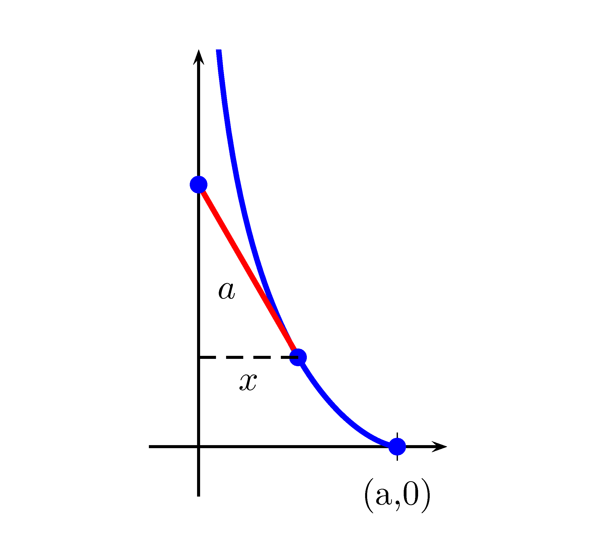

# (PART) Les équations différentielles {-}

# Les équations différentielles ordinaires {#edo}

Vous trouverez à la section \@ref(geogebra-equations-diff) une application [GeoGebra](https://www.geogebra.org/?lang=fr) vous permettant de visualiser les solutions d'une équation différentielle homogène d'ordre 2 à coefficients constants. À noter que cette application n'est disponible que dans la version en ligne de ce document.

## Introduction

Les équations différentielles sont à la base de la modélisation de divers phénomènes physiques, statistiques, chimiques, biologiques ou économiques, par exemple. Nous n'étudierons pas en détail comment obtenir ces équations différentielles mais nous verrons comment résoudre trois types d'équations différentielles différents.

Nous étudierons les types suivants:

 - Les équations différentielles à variables séparables
 - Les équations différentielles linéaires
 - Les équations différentielles à coefficients constants d'ordre 2

```{definition, name = "Équation différentielle ordinaire"}
Une __équation différentielle ordinaire__ est une équation de la forme:
\begin{align*}
F(t, y, y^{(1)}, y^{(2)},\ldots, y^{(n)})=0
\end{align*}
où $y$ est une fonction inconnue de $t$ et les $y^{(k)}$ sont les dérivées k-ièmes de $y$.
```

```{example}
Voici quelques exemples d'équations différentielles:

 - $\dfrac{dy}{dt}=2ty$
 - $(y^{(5)})^3+8ty^{(1)}+12y=1$
 - $y''+by'+ky=\sin(\omega x)$

```

```{definition, name = "L'ordre d'une équation différentielle"}
L'__ordre__ d'une équation différentielle est l'entier représentant l'ordre de la dérivée la plus élevée de la fonction inconnue apparaissant dans l'équation différentielle.
```

```{example}
Voici quelques exemples d'ordre de diverses équations différentielles:

 - $\dfrac{dy}{dt}=2ty$, ordre de 1
 - $(y^{(5)})^3+8ty^{(1)}+12y=1$, ordre de 5
 - $y''+by'+ky=\sin(\omega x)$, ordre de 2

```

```{definition, name = "Solution d'une équation différentielle"}
Une fonction (ou une équation) est une __solution d'une équation différentielle__ si, en la remplaçant ainsi que ses dérivées dans l'équation différentielle, l'égalité est vérifiée.
```

```{example}
Vérifiez que $y(x)=e^{2x}$ est une solution de l'équation différentielle $\dfrac{d^2y}{dx^2}-3\dfrac{dy}{dx}+2y=0$.
```
\vspace*{5cm}

```{definition, name = "Solution générale ou famille de solutions d'une équation différentielle"}
La __solution générale__ ou __famille de solutions__ d'une équation différentielle est l'ensemble de toutes les fonctions qui sont des solutions de l'équation différentielle.
```

```{example}
Montrez que $y(t)=t^2+C$ où $C\in\mathbb{R}$ est la solution générale de l'équation différentielle $\dfrac{dx}{dt}=2t$.
```
\vspace*{5cm}

```{definition, name = "Condition initiale et solution particulière d'une équation différentielle"}
Une __condition initiale__ d'une équation différentielle est un point $(x_0,y_0)$ par lequel passe la solution, où $x_0$ et $y_0\in\mathbb{R}$. Une solution de l'équation différentielle qui vérifie la condition initiale est appelée __solution particulière__ de l'équation différentielle.
```

```{remark}
Lorsque qu'une équation différentielle est d'ordre $n$, nous aurons besoin de $n$ conditions initiales pour trouver la solution particulière.
```

## Les équations différentielles à variables séparables

```{definition, name = "Équation différentielle à variables séparables"}
Une __équation différentielle à variables séparables__ est une équation différentielle qui peut s'écrire sous la forme $M(y)dy=N(x)dx$.
```

Pour trouver la solution d'une équation différentielle à variables séparables, il faut:

 - Mettre l'équation sous la forme différentielle, c'est-à-dire placer les différentielles au __numérateur__.
 - Séparer les variables en se basant sur les différentielles.
 - Intégrer de chaque côté de l'égalité, c'est-à-dire $\int M(y)dy=\int N(x)dx$


```{example}
Résolvez l'équation différentielle suivante: $\cos(y)\dfrac{dy}{dt}=t^2$.
```
\vspace*{8cm}


```{remark}
Lorsque vous trouvez la solution d'une équation différentielle, il n'est pas toujours possible d'obtenir une équation explicite (c'est-à-dire une équation où la variable dépendante est isolée). 
```

```{example}
Trouvez la solution de l'équation différentielle $x+yy'=0$ passant par le point $(3,0)$.
```
\vspace*{8cm}

```{example, name = "Modèle de Hill-Keller"}
Le modèle de Hill-Keller permet de modéliser la course d'un coureur pour de courtes distances, par exemple le 100 m ou le 200 m. Si $F$ est une constante qui correspond à la force du coureur et $\tau$ est une constante représentant les forces de frottement du coureur, l'équation du modèle est donnée par: $\dfrac{dv}{dt}=F-\dfrac{v}{\tau}$. Trouvez la vitesse d'un coureur en fonction du temps si au temps initial la vitesse du coureur est nulle.
```
\vspace*{10cm}

```{example, name = "La tractrice"}
Vous avez une laisse rigide de longueur $a$. Vous vous trouvez au point $(0,0)$ et votre chien se trouve au point $(a,0)$. Vous vous dirigez dans la direction de l'axe des $y$ positifs. L'équation différentielle qui permet de trouver le parcours de votre chien est $\dfrac{dy}{dx}=-\dfrac{\sqrt{a^2-x^2}}{x}$. Trouvez la solution de l'équation différentielle précédente.
```
```{r,echo=FALSE,fig.align="center",out.width = "75%"}

```
\vspace*{10cm}

```{example}
Trouvez les trajectoires orthogonales de la famille $x=ky^2$.
```
\vspace*{8cm}

```{example}
Trouvez les trajectoires orthogonales de la famille $y=ke^x$.
```
\vspace*{8cm}

```{example, label = "parachutiste"}
Soit un parachutiste qui tombe sous l'effet de la gravité avec une résistance de l'air proportionnelle à sa vitesse. L'équation différentielle de cette situation est : $\dfrac{dv}{dt}+\dfrac{kv}{m}=g$ où $m$, $g$ et $k$  sont des constantes positives. Trouvez la solution de l'équation différentielle précédente.
```
\vspace*{8cm}

```{example}
La loi de refroidissement de Newton dit que le taux de variation de la température $T$ d'un objet est 
proportionnel à la différence entre la température de cet objet et la température ambiante (notée $T_A$).
Trouvez l'équation différentielle décrivant le phénomène et trouvez $T$ en fonction du temps.
```
\vspace*{8cm}

## Les équations différentielles linéaires

```{definition, name = "Équation différentielle linéaire"}
Une __équation différentielle linéaire__ est de la forme:
\begin{align*}
\dfrac{dy}{dt}+P(t)y=Q(t)
\end{align*}
où $P(t)$ et $Q(t)$ sont des fonctions qui ne doivent dépendre que de la variable indépendante.
```

```{example}
Voici quelques exemples d'équations différentielles linéaires:

 - $y'+t^2y=t^3$
 - $x^3y'-x^4y=1$ (Aprés division par $x^2$)
 - $y'=y$
 
 
```


Pour être en mesure de résoudre ce type d'équations différentielles, nous devrons tout d'abord utiliser une astuce.

Posons $\mu(t)$ une fonction inconnue. Nous avons donc:
\begin{align*}
\dfrac{d}{dt}[\mu y] &= \mu\dfrac{dy}{dt}+y\dfrac{d\mu}{dt} \\
&= \mu\left(Q(t)-P(t)y\right) + y\dfrac{d\mu}{dt} \qquad \text{car EDO linéaire}\\
&= \mu Q(t)-\mu P(t)y +y\dfrac{d\mu}{dt} \\
&= \mu Q(t)+y\left(\underbrace{\dfrac{d\mu}{dt}-\mu P(t)}_{\text{posons égal à 0}}\right)
\end{align*}

Ainsi:
\begin{align*}
\dfrac{d}{dt}[\mu y] &= \mu Q(t) \\
\mu y &= \int \mu Q(t) \ dt\\
y &= \dfrac{1}{\mu} \int \mu Q(t) \ dt
\end{align*}

Pour pouvoir résoudre l'intégrale précédente, nous avons besoin de connaître $\mu$ et nous savons que:
\begin{align*}
\dfrac{d\mu}{dt}-\mu P(t) &= 0 \\
\dfrac{d\mu}{dt} &= \mu P(t) \\
\int\dfrac{1}{\mu}d\mu &= \int P(t)dt \\
\ln |\mu| &= \int P(t)dt \\
\mu &= e^{\int P(t)dt}
\end{align*}

Pour résoudre une équation différentielle linéaire, il faut donc:

 1. Trouver $\mu$: $\mu = e^{\int P(t)dt}$
 1. Trouver $y$: $y = \dfrac{1}{\mu} \int \mu Q(t) \ dt$
 
```{example}
Trouvez la solution générale de $y'+3\dfrac{y}{t}=1$.
```
\vspace*{8cm}

```{example}
Trouvez la solution générale de $x^2y'+xy=1$ où $x>0$ et $y(1)=2$.
```
\vspace*{8cm}

```{example}
Trouvez la solution générale de $ty'+2y=t^2-t+1$.
```
\vspace*{8cm}

```{example}
Trouvez la solution générale de $\cos(x)y'+\sin(x)y=2\cos(x)^3\sin(x)-1$.
```
\vspace*{8cm}

```{example}
Résolvez l'équation différentielle du parachutiste, comme vu à l'exemple \@ref(exm:parachutiste), en utilisant les équations différentielles linéaires. L'équation différentielle est donnée par : $\dfrac{dv}{dt}+\dfrac{kv}{m}=g$.
```
\vspace*{8cm}

### Problèmes de mélange

Dans des problèmes de mélange, nous cherchons $Q(t)$ qui représente la quantité d'une substance en fonction du temps. L'équation différentielle de base de ce genre de problèmes est:

> Taux de variation de $Q(t)$ = Taux d'entrée de $Q(t)$ - Taux de sortie de $Q(t)$

```{example}
Une cuve contient 10 L d'eau salée dans laquelle 2 kg de sel sont dissout. De l'eau salée contenant 1 kg de sel par litre entre dans la cuve à un débit constant de 3 L/min, et l'eau mélangée est vidée à un taux de 4 L/min. Trouvez la quantité de sel en fonction du temps $Q(t)$.
```
\vspace*{10cm}

```{example}
Une cuve contient 40 L d'eau pure. De la saumure avec 3 kg de sel par litre entre dans la cuve à un débit constant de 2 L/min, et la mixture mélangée s'écoule à un débit constant de 3 L/min.

 a) Trouvez la quantité de sel en fonction du temps $Q(t)$.
 b) Quelle est la quantité de sel lorsqu'il reste 20 L dans la cuve?
 
 
```
\vspace*{10cm}

### Inverser la dérivée

Pour obtenir une équation différentielle linéaire, il faut parfois étudier l'inverse de votre dérivée.

> Plutôt que d'étudier $\dfrac{dy}{dx}$, nous pouvons étudier $\dfrac{dx}{dy}$.

```{example}
Trouvez la solution de l'équation différentielle $(e^y-2xy)\dfrac{dy}{dx}=y^2$.
```
\vspace*{8cm}

```{example}
Trouvez les familles de courbes orthogonales à $y^2=ce^x+x+1$ où $c\in\mathbb{R}$.
```
\vspace*{8cm}

## Les équations différentielles à coefficients constants d'ordre 2

### Quelques rappels concernant les nombres complexes

```{definition, name = "Nombre complexe"}
Un nombre complexe $z$ s'écrit sous la forme $z=a+bi$, où $a,b \in \mathbb{R}$ et tel que $i^2=-1$. 

Nous disons que $a$ est la partie réelle de $z$ et $b$ est la partie imaginaire de $z$.

L'ensemble des nombres complexes est noté $\mathbb{C}$.

Nous pouvons également écrire $z$ sous une form dite polaire qui est $z=r(\cos(\theta)+i\sin(\theta))$, où $r=\sqrt{a^2+b^2}$ et $\theta=\text{Arctan}\left(\dfrac{b}{a}\right)$.
```

La figure \@ref(fig:nombrescomplexes) permet de représenter un nombre complexe de façon géométrique.

```{r,echo=FALSE,fig.align="center",label="nombrescomplexes",out.width="50%",fig.cap="Représentation d'un nombre complexe"}
knitr::include_graphics("resources/images/latex/nombrescomplexes.png")
```

```{theorem, name = "L'identité d'Euler", label = "identite-euler"}
Soit le nombre complexe écrit sous la forme $z=r(\cos(\theta)+i\sin(\theta))$. Alors ce nombre peut s'écrire de la manière suivante: $z=re^{i\theta}$.
```
```{proof}
La démonstration est laissée à l'étudiante ou l'étudiant. __Astuce__: Il faut utiliser les séries de MacLaurin de $e^x$, $\sin(x)$ et $\cos(x)$.
```

```{corollary, label = "sin-cos-ei"}
Nous avons:
\begin{align*}
\cos(\theta) &= \dfrac{e^{i\theta}+e^{-i\theta}}{2} \\
\sin(\theta) &= \dfrac{e^{i\theta}-e^{-i\theta}}{2i}
\end{align*}

```
```{proof}
Pour démontrer ce résultat, nous utiliserons le théorème \@ref(thm:identite-euler). Nous avons:
\begin{align}
e^{i\theta} &= \cos(\theta)+i\sin(\theta)(\#eq:eplus) \\
e^{-i\theta} &= \cos(-\theta)+i\sin(-\theta) \notag \\
&= \cos(\theta)-i\sin(\theta)(\#eq:emoins)
\end{align}

Si nous additions les équations \@ref(eq:eplus) et \@ref(eq:emoins):
\begin{align*}
e^{i\theta}+e^{-i\theta} &= \cos(\theta)+i\sin(\theta)+\cos(\theta)-i\sin(\theta) \\
&= 2\cos(\theta) \\
\cos(\theta) &= \dfrac{e^{i\theta}+e^{-i\theta}}{2}
\end{align*}

Si nous faisons la différence entre les équations \@ref(eq:eplus) et \@ref(eq:emoins):
\begin{align*}
e^{i\theta}-e^{-i\theta} &= \cos(\theta)+i\sin(\theta)-(\cos(\theta)-i\sin(\theta)) \\
&= 2i\sin(\theta) \\
\sin(\theta) &= \dfrac{e^{i\theta}-e^{-i\theta}}{2i}
\end{align*}


```

### Les équations différentielles homogènes à coefficients constants d'ordre 2

```{definition, name = "Équation différentielle homogène à coefficients constants d'ordre 2"}
Une __équation différentielle homogène à coefficients constants d'ordre 2__ est une équation différentielle de la forme:
\begin{align}
a\dfrac{d^2y}{dx^2}+b\dfrac{dy}{dx}+cy &= 0 (\#eq:homogene2)
\end{align}
où $a,b,c \in \mathbb{R}$ et $a\neq 0$.
```

> Le terme *homogène* indique que le membre de droite de l'équation \@ref(eq:homogene2) est nul. Nous traiterons le cas à la section \@ref(non-homogene-2).

Avant de résoudre ce type d'équations différentielles, la prochaine proposition sera cruciale.

```{proposition, label = "combinaison-lineaire-solution"}
Si $y_1(x)$ et $y_2(x)$ sont deux solutions de l'équation \@ref(eq:homogene2), alors $y(x)=C_1y_1(x)+C_2y_2(x)$, où $C_1,C_2\in\mathbb{R}$, est aussi une solution de l'équation \@ref(eq:homogene2).
```
```{proof}
Nous avons que:
\begin{align*}
ay_1''+by_1'+cy_1 &= 0 \\
ay_2''+by_2'+cy_2 &= 0
\end{align*}
car $y_1$ et $y_2$ sont des solutions de \@ref(eq:homogene2). Nous avons que:
\begin{align*}
y &= C_1y_1+C_2y_2 \\
y' &= C_1y_1'+C_2y_2' \\
y'' &= C_1y_1''+C_2y_2'' \\
\end{align*}
Ainsi:
\begin{align*}
ay''+by'+cy &= a(C_1y_1''+C_2y_2'')+b(C_1y_1'+C_2y_2')+c(C_1y_1+C_2y_2) \\
&= C_1\underbrace{(ay_1''+by_1'+cy_1)}_{=\ 0}+C_2\underbrace{(ay_2''+by_2'+cy_2)}_{=\ 0} \\
&= 0
\end{align*}

```

> Une combinaison linéaire de solutions est aussi une solution.

Nous pouvons maintenant résoudre l'équation \@ref(eq:homogene2)  en supposant que la solution est de la forme $y=e^{rx}$, où $r$ est une constante qu'il nous reste à déterminer. 

> Pour résoudre une équation différentielle homogène d'ordre 2 à coefficients constants, il faut toujours poser la solution $y=e^{rx}$.

Nous avons donc:
\begin{align*}
y &= e^{rx} \\
y' &= re^{rx} \\
y'' &= r^2e^{rx}
\end{align*}

Nous substituons ces résultats dans l'équation \@ref(eq:homogene2):
\begin{align}
a\dfrac{d^2y}{dx^2}+b\dfrac{dy}{dx}+cy &= 0 \notag \\
ar^2e^{rx}+bre^{rx}+ce^{rx} &= 0 \notag \\
e^{rx}(ar^2+br+c) &= 0 \notag \\
ar^2+br+c &= 0(\#eq:quadratique)
\end{align}

L'équation \@ref(eq:quadratique) se nomme polynôme caractéristique de l'équation \@ref(eq:homogene2). Déterminer les valeurs de $r$ revient à trouver les racines du polynôme caractéristique et donc:
\begin{align*}
r_{1,2} &= \dfrac{-b\pm\sqrt{b^2-4ac}}{2a}
\end{align*}
Nous devrons étudier trois cas distincts qui dépendent du discriminant $b^2-4ac$.

#### Cas 1: $b^2-4ac>0$

Dans ce cas, le polynôme caractéristique fournit deux valeurs de $r$ __réelles__, que nous notons $r_1$ et $r_2$. Nous avons donc $y_1(x)=e^{r_1x}$ qui est une solution de \@ref(eq:homogene2) et également $y_2=e^{r_2x}$. Par la proposition \@ref(prp:combinaison-lineaire-solution), nous obtenons la solution générale:
\begin{align*}
y(x) &= C_1e^{r_1x}+C_2e^{r_2x}
\end{align*}
où $C_1,C_2\in\mathbb{R}$.

```{example}
Résolvez l'équation différentielle $y''+y'-6y=0$ avec comme conditions initiales $y(0)=0$ et $y'(0)=1$.
```
\vspace*{10cm}


#### Cas 2: $b^2-4ac<0$

Dans ce cas, le polynôme caractéristique fournit deux valeurs de $r$ __complexes__. Posons $\gamma=-\dfrac{b}{2a}$ et $\omega=\dfrac{\sqrt{4ac-b^2}}{2a}$ ce qui implique que $r_1=\gamma+\omega i$ et $r_2=\gamma -\omega i$. Nous avons donc deux solutions à l'équation \@ref(eq:homogene2), soit $y_1=e^{r_1x}=e^{(\gamma+\omega i)x}$ et $y_2=e^{r_2x}=e^{(\gamma-\omega i)x}$.

Puisque les solutions précédentes sont complexes, nous allons utiliser la proposition \@ref(prp:combinaison-lineaire-solution) et le corollaire \@ref(cor:sin-cos-ei) pour créer deux nouvelles solutions réelles:
\begin{align*}
y_3(x) &= \dfrac{y_1(x)+y_2(x)}{2} \\
&= \dfrac{e^{(\gamma+\omega i)x}+e^{(\gamma-\omega i)x}}{2} \\
&= e^{\gamma x}\left( \dfrac{e^{\omega i x}+e^{-\omega i x}}{2} \right) \\
&= e^{\gamma x}\cos(\omega x) \\
y_4(x) &= \dfrac{y_1(x)-y_2(x)}{2i} \\
&= \dfrac{e^{(\gamma+\omega i)x}-e^{(\gamma-\omega i)x}}{2i} \\
&= e^{\gamma x}\left( \dfrac{e^{\omega i x}-e^{-\omega i x}}{2i} \right) \\
&= e^{\gamma x}\sin(\omega x)
\end{align*}

D'où la solution générale de l'équation \@ref(eq:homogene2) est:
\begin{align*}
y(x) &= e^{\gamma x}\left( C_1\cos(\omega x)+C_2\sin(\omega x) \right)
\end{align*}

```{example}
Trouvez la solution de l'équation différentielle $y''+2y'+10y=0$ ayant comme conditions initiales $y(0)=0$ et $y'(0)=3$.
```
\vspace*{10cm}

#### Cas 3: $b^2-4ac=0$

Dans ce cas, nous n'obtenons qu'une seule valeur de $r=-\dfrac{b}{2a}$. Puisque nous n'avons qu'une seule solution, nous devons en trouver une autre pour être en mesure de construire une combinaison linéaire. Nous allons démontrer que $y_2(x)=xe^{rx}$ est aussi une solution de l'équation différentielle \@ref(eq:homogene2).
```{proof}
\begin{align*}
y_2 &= xe^{rx} \\
y_2' &= e^{rx}+rxe^{rx} \\
y_2'' &= re^{rx}+re^{rx}+r^2xe^{rx}
\end{align*}
Et donc:
\begin{align*}
ay'' +by' +cy &= 0 \\
a(2re^{rx}+r^2xe^{rx})+b(e^{rx}+rxe^{rx})+c(xe^{rx}) &= 0 \\
e^{rx}(2ar+ar^2x+b+brx+cx) &= 0 \\
e^{rx}(\underbrace{(ar^2+br+c)}_{=0}x+\underbrace{(2ar+b)}_{=0}) &= 0 
\end{align*}

```

La solution générale est donc de la forme:
\begin{align*}
y(x) &= C_1e^{rx}+C_2xe^{rx}
\end{align*}

```{example}
Trouvez la solution de l'équation différentielle $y''+2y'+y=0$.
```
\vspace*{5cm}

```{example}
Trouvez les solutions des équations différentielles suivantes:

  a) $y''-9y'+20y=0$
  a) $2y''-4y'+8y=0$
  a) $y''+6y'+9=0$


```
\vspace*{20cm}

### Les équations différentielles non homogènes à coefficients constants d'ordre 2 {#non-homogene-2}

```{definition, name = "Équation différentielle non homogène à coefficients constants d'ordre 2"}
Une __équation différentielle non homogène à coefficients constants d'ordre 2__ est une équation différentielle de la forme:
\begin{align}
a\dfrac{d^2y}{dx^2}+b\dfrac{dy}{dx}+cy &= F(x) (\#eq:nonhomogene2)
\end{align}
où $a,b,c \in \mathbb{R}$ et $a\neq 0$. De plus $F(x)$ est une fonction qui ne dépend que de la variable indépendante.
```

Pour résoudre ce type d'équations différentielles, nous aurons besoin du théorème suivant:

```{theorem}
Soit une équation différentielle de la forme:
\begin{align*}
a\dfrac{d^2y}{dx^2}+b\dfrac{dy}{dx}+cy &= F(x)
\end{align*}
La solution de cette équation différentielle est de la forme:
\begin{align*}
y(x) &= C_1y_1(x)+C_2y_2(x)+y_p
\end{align*}
où $y_1$ et $y_2$ sont les solutions de l'équation homogène associée à l'équation \@ref(eq:nonhomogene2), c'est-à-dire:
\begin{align*}
a\dfrac{d^2y}{dx^2}+b\dfrac{dy}{dx}+cy &= 0
\end{align*}
et $y_p$ est une solution particulière de l'équation non homogène.

```
```{proof}
La démonstration est laissée à l'étudiante ou à l'étudiant.
```

Nous verrons deux méthodes pour trouver $y_p$.

#### La méthode des coefficients indéterminés

Cette méthode consiste à étudier la nature de la fonction $F(x)$ et à supposer que $y_p$ est de même nature. La table \@ref(tab:coeff-indetermines) montre la forme de la solution particulière $y_p$ selon la nature de $F(x)$.

Table: (\#tab:coeff-indetermines) Les diverses formes de coefficients indéterminés.

|                        Forme de $F(x)$                       |               Forme de $y_p$               |
|:------------------------------------------------------------:|:------------------------------------------:|
|                     Polynôme de degré $n$                    | $y_p=a_nx^n+a_{n-1}x^{n-1}+\ldots+a_x+a_0$ |
| $F(x)$ possède un $\sin(\omega x)$ et/ou un $\cos(\omega x)$ |    $y_p=A\cos(\omega x)+B\sin(\omega x)$   |
|        $F(x)$ possède une exponentielle $e^{\alpha x}$       |             $y_p=A^{\alpha x}$             |

```{example}
Trouvez la solution générale de l'équation différentielle $y''+y'-6y=3x^2$.
```
\vspace*{10cm}

```{example}
Trouvez la solution générale de l'équation différentielle $y''+y'-6y=e^{4x}+\cos(3x)$.
```
\vspace*{10cm}

```{example}
Trouvez la solution générale de l'équation différentielle $y''+2y'+10y=\cos(2t)$ avec les conditions intiales $y(0)=-\frac{1}{2}$ et $y'(0)=4$.
```
\vspace*{15cm}


#### La méthode de variation des paramètres (ou méthode de Lagrange)

La méthode de variation des paramètres est souvent plus longue à utiliser que la méthode des coefficients indéterminés, par contre, elle est valide pour tous les types de fonctions $F(x)$.

Nous débutons en trouvant les solutions $y_1$ et $y_2$ de l'équation différentielle homogène associée à l'équation:
\begin{align*}
ay''+by'+cy=F(x)
\end{align*}

Supposons que la solution est de la forme :
\begin{align*}
y(x) &= \mu_1(x)y_1(x)+\mu_2(x)y_2(x)
\end{align*}
Afin d'alléger la notation, nous omettrons la dépendance en $x$. Nous cherchons donc $\mu_1$ et $\mu_2$. Avant de substituer dans l'équation différentielle, nous allons trouver les dérivées successives de $y$.
\begin{align*}
y' &= \mu_1y_1'+\mu_1'y_1+\mu_2'y_2+\mu_2y_2'
\end{align*}
Nous allons maintenant faire la supposition que $\mu_1'y_1+\mu_2'y_2=0$ et donc:
\begin{align*}
y' &= \mu_1y_1'+\mu_2y_2'
\end{align*}
Trouvons maintenant la dérivée seconde:
\begin{align*}
y' &= \mu_1'y_1'+\mu_1y_1''+\mu_2'y_2'+\mu_2y_2''
\end{align*}
Nous avons donc:
\begin{align*}
ay''+by'+cy &= F(x) \\
a(\mu_1'y_1'+\mu_1y_1''+\mu_2'y_2'+\mu_2y_2'')+b(\mu_1y_1'+\mu_2y_2')+c(\mu_1y_1+\mu_2y_2) &= F(x) \\
\mu_1\underbrace{(ay_1''+by_1'+cy_1)}_{=0}+\mu_2\underbrace{(ay_2''+by_2'+cy_2)}_{=0}+\mu_1'y_1'+\mu_2'y_2' &= F(x) \\
\mu_1'y_1'+\mu_2'y_2' &= F(x)
\end{align*}
Ainsi, pour déterminer $\mu_1$ et $\mu_2$, nous avons les deux équations suivantes:
\begin{align*}
\mu_1'y_1+\mu_2'y_2 &= 0 \\
\mu_1'y_1'+\mu_2'y_2' &= F(x)
\end{align*}
Nous pouvons utiliser la méthode de Cramer pour résoudre ce système d'équations linéaires:
\begin{align*}
\mu_1'&= \dfrac{
\begin{vmatrix}
0&y_2\\
F(x)&y_2'
\end{vmatrix}}{
\begin{vmatrix}
y_1 &y_2\\
y_1'&y_2'
\end{vmatrix}
}=-\dfrac{y_2F(x)}{W(y_1,y_2)}\\
\mu_2'&= \dfrac{
\begin{vmatrix}
y_1&0\\
y_1'&F(x)
\end{vmatrix}}{
\begin{vmatrix}
y_1 &y_2\\
y_1'&y_2'
\end{vmatrix}
}=\dfrac{y_1F(x)}{W(y_1,y_2)}
\end{align*}

```{definition,name="Wronskien"}
Nous appelons le __Wronskien__ de deux fonctions $y_1$ et $y_2$, le résultat suivant:
\begin{align*}
W(y_1,y_2)=\begin{vmatrix}
y_1 &y_2\\
y_1'&y_2'
\end{vmatrix}
\end{align*}

```

```{remark}
Le __Wronskien__ n'est jamais égal à zéro lorsque nous résolvons une équation différentielle car $y_1$ et $y_2$ sont choisies pour être linéairement indépendantes.
```

Nous pouvons maintenant trouver nos deux fonctions $\mu_1$ et $\mu_2$:
\begin{align*}
\mu_1&=-\int \dfrac{y_2(x)F(x)}{W(y_1,y_2)}dx\\
\mu_2&=\int \dfrac{y_1(x)F(x)}{W(y_1,y_2)}dx
\end{align*}

```{example}
Trouvez la solution particulière de l'équation différentielle $y''+y=\csc(x)$.
```
\vspace*{10cm}

```{example}
Trouvez les solutions des équations différentielles suivantes en utilisant les deux méthodes:

  - Méthode des coefficients indéterminés
  - Méthode de variation des paramètres

  a. $y''-2y'+y=2x$
  a. $y''-y'-6y=e^{-x}$
  
  
```

## Applications des équations différentielles du deuxième ordre à coefficients constants

Nous discuterons en particulier de l'oscillateur harmonique forcé. 

```{example, name="Oscillateur harmonique forcé"}
Soit un ressort de constante $k$ auquel nous attachons une masse $M$. Si le frottement est proportionnel à la vitesse de la masse et que celle-ci subit une force périodique, nous pouvons décrire le mouvement avec l'équation suivante:
\begin{align*}
\dfrac{d^2x}{dt^2}+\dfrac{c}{M}\dfrac{dx}{dt}+\dfrac{k}{M}x &= \dfrac{F_0}{M}\cos(\omega t)
\end{align*}
Nous pouvons réécrire l'équation précédente en introduisant les variables $b=\dfrac{c}{2M}$ et $a=\sqrt{\dfrac{k}{M}}$:
\begin{align*}
\dfrac{d^2x}{dt^2}+2b\dfrac{dx}{dt}+a^2x &= \dfrac{F_0}{M}\cos(\omega t)
\end{align*}
Ce changement nous simplifiera le travail.

  a. Trouvez la solution homogène de l'équation différentielle.
  a. Supposez que $b=0$, c'est-à-dire qu'il n'y a pas de frottement. Trouvez la solution particulière dans le cas où $a\neq \omega$. (Vous étudiez dans ce cas la situation des __battements__). Pour en savoir plus sur le phénomène de [battements](https://fr.wikipedia.org/wiki/Battement_(physique)).
  a. Supposez que $b=0$, c'est-à-dire qu'il n'y a pas de frottement. Trouvez la solution particulière dans le cas où $a =\omega$. (Vous étudiez dans ce cas la situation de __résonnance__) Pour voir en action le phénomène de résonnance, [Tacoma Narrows Bridge](https://www.youtube.com/watch?v=j-zczJXSxnw) .

```

## GeoGebra {#geogebra-equations-diff}

<script type="text/javascript" src="https://cdn.geogebra.org/apps/deployggb.js"></script>
<script type="text/javascript">
var parameters = {
"appName":"graphing",
"material_id":"vcv92e6s",
"width":800,
"height":600,
"showToolBar":true,
"borderColor":null,
"showMenuBar":true,
"showFullscreenButton":true,
"enableShiftDragZoom":true};

var applet = new GGBApplet(parameters, 'applet_container');
window.onload = function() { applet.inject('applet_container'); updateHelp('AG');}
</script>
<div id="applet_container"></div>

\newpage
## Pages supplémentaires

Des pages blanches supplémentaires pour ajouter, potentiellement, de nouveaux exemples et exercices.

<!-- Code pour insérer des pages blanches dans le document pdf pour des exemples supplémentaires. -->

\multido{\i=1+1}{4}{
\newpage
\mbox{}
}
