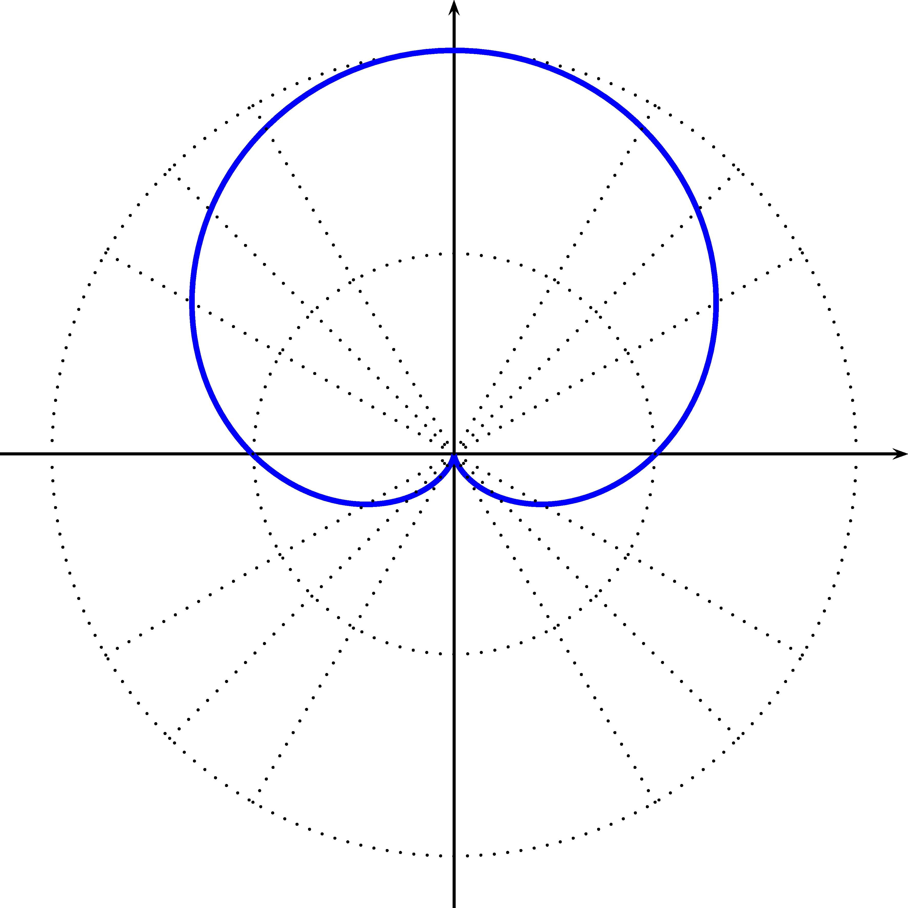
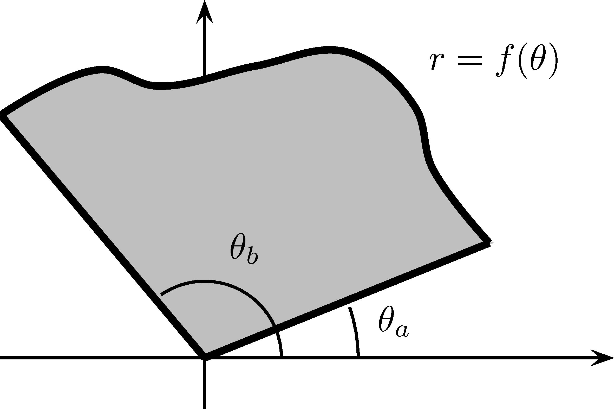

# Les coordonnées polaires {#coordpolaires}

Vous trouverez à la section \@ref(geogebra-polaire) une application [GeoGebra](https://www.geogebra.org/?lang=fr) vous permettant de visualiser des courbes en coordonnées polaires. À noter que cette application n'est disponible que dans la version en ligne de ce document.

## Introduction

Les coordonnées polaires sont un autre système pour décrire un point $P$ de $\mathbb{R}^2$. Les coordonnées cartésiennes associent à chaque point $P$ un couple $(x,y)$. Les coordonnées polaires consistent à décrire ce point $P$ avec le couple $(r,\theta)$, où $r$ est la longueur du segment de droite reliant l'origine au point $P$ et $\theta$ est l'angle entre ce segment de droite et l'axe des $x$ positifs. La figure \@ref(fig:coordpolaires) représente ce type de coordonnées.

```{r,echo=FALSE,fig.align="center",label="coordpolaires",out.width="50%",fig.cap="Coordonnées polaires d'un point $P$"}
knitr::include_graphics("resources/images/latex/coordpolaires.png")
```

Il est primordial de pouvoir convertir les coordonnées cartésiennes à des coordonnées polaires et vice-versa.

```{proposition,name="Coordonnées cartésiennes à coordonnées polaires"}
Soit un point $P$ en coordonnées cartésiennes $(x,y)$. La conversion en coordonnées polaires est:
\begin{align*}
r &= \sqrt{x^2+y^2} \\
\theta &= \text{Arctan}\left(\dfrac{y}{x}\right)
\end{align*}
  
```

```{proposition,name="Coordonnées polaires à coordonnées cartésiennes"}
Soit un point $P$ en coordonnées polaires $(r,\theta)$. La conversion en coordonnées cartésiennes est:
\begin{align*}
x &= r\cos(\theta) \\
y &= r\sin(\theta)
\end{align*}
  
```

```{remark}
Voici quelques remarques:

  1. L'origine, c'est-à-dire le point $(0,0)$ en coordonnées cartésiennes, que l'on appelle pôle, peut s'écrire $(0,\theta)$, et ce, pour toutes les valeurs de $\theta$ possibles. Ceci signifie qu'il n'existe pas de bijection[^1] entre les coordonnées cartésiennes et polaires. Par contre, si on enlève l'origine, il en existe une.
  1. Lorsque l'on fixe $\theta=\theta_0$, l'ensemble formé par $(r,\theta_0)$est une demi-droite. En acceptant que $r$ soit négatif, on obtient alors que $(r,\theta_0)$ forme une droite.
  1. Si $r>0$, alors $(-r,\theta_0)=(r,\theta_0+\pi)$.


```

[^1]: Une bijection est une fonction $f$ allant d'un ensemble $A$ à un ensemble $B$,
telle que pour tous les éléments de $B$, on associe une seule valeur de $A$. 

```{example}
Écrivez les points suivants en coordonnées polaires:
  
  a. $P_1=(1,1)$
  a. $P_2=(-\sqrt{3},1)$
  a. $P_3=(0,-2)$


```
\vspace*{10cm}

```{example}
Écrivez les points suivants en coordonnées cartésiennes:
  
  a. $(2,\pi/3)$
  a. $(3,3\pi/4)$
  
  
```
\vspace*{10cm}

```{example}
Écrivez l'équation de la perle de Sluze en coordonnées polaires, si $y^2=x(8-x)$.
```
\vspace*{6cm}

## Le graphique d'une équation polaire $r=f(\theta)$

Étudions maintenant comment représenter graphiquement des équations polaires de la forme $r=f(\theta)$. Nous généraliserons le tout pour des équations implicites de la forme $F(r,\theta)=0$.

```{example}
Dessinez la courbe $r=K$ où $K$ est une constante et $K>0$.
```
\vspace*{5cm}

```{example}
Dessinez la courbe $\theta=\dfrac{\pi}{4}$.
```
\vspace*{5cm}

Pour être en mesure de dessiner des relations en coordonnées polaires, nous aurons besoin d'une grille polaire.

```{definition,name="Grille polaire"}
Une grille polaire est une grille où nous traçons les courbes telles que $r$ est constant, c'est-à-dire des cercles centrés en $(0,0)$ et telles que $\theta$ est constante, c'est-à-dire les droites passant par l'origine et faisant un angle $\theta$ avec l'axe des $x$. 

Nous représentons habituellement les cercles de rayons $1$ à $5$ et les droites d'angles $\frac{\pi}{6}$ ($30^{\circ}$), $\frac{\pi}{4}$ ($45^{\circ}$) et $\frac{\pi}{3}$ ($60^{\circ}$).

Une grille polaire est représentée à la figure \@ref(fig:grillepolaire).
```

```{r,echo=FALSE,fig.align="center",label="grillepolaire",out.width="50%",fig.cap="Grille polaire"}
knitr::include_graphics("resources/images/latex/grillepolaire.png")
```

```{example}
Dessinez $r=1=\sin(2\theta)$.
```
```{r,echo=FALSE,fig.align="center",label="ex1courbepolaire",out.width="50%"}
knitr::include_graphics("resources/images/latex/ex1courbepolaire.png")
```

```{example}
Dessinez $r=1=\sin(\theta)$ pour $\theta\in [0,2\pi]$.
```
```{r,echo=FALSE,fig.align="center",label="ex2courbepolaire",out.width="50%"}

```

## Tangente à une courbe polaire

Nous voulons maintenant déterminer les tangentes à des courbes polaires. Nous savons que $x=r\cos(\theta)$ et que $y=r\sin(\theta)$. Si $r=f(\theta)$ alors nous avons que $x=x(\theta)$ et $y=y(\theta)$, c'est-à-dire que $x$ et $y$ sont des fonctions de $\theta$.

```{theorem,name="Tangentes à une courbe polaire",label="tangente-polaire"}
Soit $x$ et $y$ deux fonctions de $\theta$. Si $r=f(\theta)$, nous avons:
\begin{align*}
\dfrac{dy}{dx} &= \dfrac{f'(\theta)\sin(\theta)+f(\theta)\cos(\theta)}{f'(\theta)\cos(\theta)-f(\theta)\sin(\theta)}
\end{align*}

```
```{proof}
Trouvons $\dfrac{dx}{d\theta}$ et $\dfrac{dy}{d\theta}$.
\begin{align*}
\dfrac{dx}{d\theta} &= \dfrac{d}{d\theta}\left[f(\theta)\cos(\theta)]\right] \\
&=  f'(\theta)\cos(\theta)-f(\theta)\sin(\theta) \\
\dfrac{dy}{d\theta} &= \dfrac{d}{d\theta}\left[f(\theta)\sin(\theta)]\right] \\
&=  f'(\theta)\sin(\theta)+f(\theta)\cos(\theta) 
\end{align*}
Ainsi,
\begin{align*}
\dfrac{dy}{dx} &= \dfrac{\dfrac{dy}{d\theta}}{\dfrac{dx}{d\theta}} \\
&= \dfrac{f'(\theta)\sin(\theta)+f(\theta)\cos(\theta)}{f'(\theta)\cos(\theta)-f(\theta)\sin(\theta)}
\end{align*}

```

Nous avons maintenant une formule pour déterminer la pente de la droite tangente.

```{example}
Trouvez l'équation de la droite tangente en $\theta=\frac{\pi}{2}$ de $r=1+\sin(2\theta)$.
```
\vspace*{8cm}

```{example}
Soit l'équation $r=2\cos(\theta)$.

  a. Trouvez la dérivée $\dfrac{dy}{dx}$.
  a. Évaluez $\left.\dfrac{dy}{dx}\right|_{\theta=\frac{\pi}{4}}$.
  a. Évaluez $\left.\dfrac{dy}{dx}\right|_{\theta=\frac{\pi}{3}}$.

```
\vspace*{10cm}

```{example}
Trouvez la dérivée de la rose de Ghandi, $r=\cos\left(\dfrac{3\theta}{2}\right)$.
```
\vspace*{6cm}

## Aire d'une région

Nous voulons maintenant trouver une formule afin de calculer l'aire d'une région formée par une courbe définie par $r=f(\theta)$ avec $\theta_a\leq \theta \leq \theta_b$.

Rappelons que l'aire $A$ d'un secteur de cercle de rayon $r$ est donnée par $A=\dfrac{1}{2}r^2\theta$.

La figure \@ref(fig:airepolaire1) représente la surface que nous désirons trouver.

```{r,echo=FALSE,fig.align="center",label="airepolaire1",out.width="50%",fig.cap="Aire d'une courbe polaire"}

```

Divisons l'intervalle $\theta_a\leq \theta \leq \theta_b$ en $N$ partitions de longueur $\Delta \theta_i=\theta_i-\theta_{i-1}$ pour $i=1,\ldots,N$. L'ensemble
\begin{align*}
\{\theta_0=\theta_a,\theta_1,...,\theta_{N-1},\theta_{N}=\theta_b\}
\end{align*}
est appelée partition de $\theta_a\leq \theta \leq \theta_b$. L'aire de chacun de ces secteurs peut être approchée par:
\begin{align*}
A_i\approx \dfrac{1}{2}[f(\theta_i^*)]^2\Delta \theta_i, \quad \text{où $\theta_i^*\in [\theta_{i-1},\theta_{i}]$}
\end{align*}

La figure \@ref(fig:airepolaire2) représente une partition.

```{r,echo=FALSE,fig.align="center",label="airepolaire2",out.width="50%",fig.cap="Aire d'une courbe polaire: séparation en secteurs"}
knitr::include_graphics("resources/images/latex/airepolaire2.png")
```

Nous voulons trouver l'aire totale, c'est-à-dire la somme des surfaces des $N$ secteurs:
\begin{align*}
A\approx \sum_{i=1}^N\dfrac{1}{2}[f(\theta_i^*)]^2\Delta \theta_i
\end{align*}
Nous remarquons que cette somme est une somme de Riemann. Ainsi, en prenant la limite lorsque $N$ tend vers l'infini, nous obtenons:
\begin{align*}
A=\lim_{N\rightarrow \infty } \sum_{i=1}^N\dfrac{1}{2}[f(\theta_i^*)]^2\Delta \theta_i=\int_{\theta_a}^{\theta_b}\dfrac{1}{2}[f(\theta)]^2d \theta
\end{align*}

D'où, l'aire est donnée par:
\begin{align*}
A &= \int_{\theta_a}^{\theta_b}\dfrac{1}{2}[f(\theta)]^2 d\theta
\end{align*}

```{example}
Calculez l'aire de la région formée par $r=1+\sin(2\theta)$.
```
```{r,echo=FALSE,fig.align="center",label="ex1airepolaire",out.width="50%"}
knitr::include_graphics("resources/images/latex/ex1airepolaire.png")
```
\vspace*{10cm}


```{example}
Calculez l'aire située au-dessus du cercle $r=3\sin(\theta)$ et en dessous de la cardioïde $r=1+\sin(\theta)$.
```
```{r,echo=FALSE,fig.align="center",label="ex2airepolaire",out.width="50%"}
knitr::include_graphics("resources/images/latex/ex2airepolaire.png")
```
\vspace*{10cm}

```{example}
Calculez l'aire d'une seule feuille de $r=1+\sin(\theta)$ avec $0\leq \theta \leq \frac{\pi}{3}$.
```
\vspace*{10cm}

```{example}
Calculez l'aire du quadrifolium $r=\cos(2\theta)$ si un seul pétale se trouve dans l'intervalle $\frac{\pi}{4}\leq \theta \leq \frac{3\pi}{4}$.
```
\vspace*{10cm}

## Longueur d'une courbe

```{theorem,name="Longueur d'une courbe en coordonnées polaires"}
La longueur d'une courbe en coordonnées polaires  définie par $r=f(\theta)$ où $\theta_a\leq\theta\leq\theta_b$ est donnée par:
\begin{align*}
L=\int_{\theta_a}^{\theta_b}\sqrt{\left(\dfrac{dr}{d\theta}\right)^2+r^2}d\theta
\end{align*}

```
```{proof}
La démonstration suivante escamote plusieurs utilisations des sommes de Riemann pour simplifier.

Nous savons que:
\begin{align*}
L &= \int_a^b \sqrt{1+\left(\dfrac{dy}{dx}\right)^2}dx \\
&= \int_a^b \sqrt{(dx)^2\left(1+\left(\dfrac{dy}{dx}\right)^2\right)} \\
&= \int_a^b \sqrt{(dx)^2+(dy)^2} \\
&= \int_a^b \sqrt{\left(\dfrac{dx}{d\theta}d\theta\right)^2+\left(\dfrac{dy}{d\theta}d\theta\right)^2} \\
&= \int_a^b \sqrt{\left(\dfrac{dx}{d\theta}\right)^2+\left(\dfrac{dy}{d\theta}\right)^2}d\theta
\end{align*}
Nous savons par le théorème \@ref(thm:tangente-polaire) ce que sont $\dfrac{dx}{d\theta}$ et $\dfrac{dy}{d\theta}$. Ainsi:
\begin{align*}
L &= \int_a^b \sqrt{\left(\dfrac{dr}{d\theta}\cos(\theta)-r\sin(\theta)\right)^2+\left(\dfrac{dr}{d\theta}\sin(\theta)+r\cos(\theta)\right)^2}d\theta \\
&= \ldots \\
&= \int_{\theta_a}^{\theta_b}\sqrt{\left(\dfrac{dr}{d\theta}\right)^2+r^2}d\theta 
\end{align*}

```

Voici quelques exemple de longueurs d'arc.

```{example}
Calculez la longueur d'arc de $r=e^{2\theta}$ avec $\theta\in[0,2\pi]$.
```
\vspace*{8cm}

```{example}
Calculez la longueur d'arc de $r=2-2\cos(\theta)$ avec $\theta\in[0,2\pi]$.
```
\vspace*{8cm}

```{example}
Calculez la longueur d'arc de $r=ae^{-b\theta}$ avec $\theta\in[0,\infty[$ et $b>0$.
```
\vspace*{10cm}

```{example}
Calculez la longueur d'arc de $r=a(1-\sin(\theta))$ avec $\theta\in[0,2\pi]$.
```
\vspace*{8cm}


## GeoGebra {#geogebra-polaire}

<script type="text/javascript" src="https://cdn.geogebra.org/apps/deployggb.js"></script>
<script type="text/javascript">
var parameters = {
"appName":"graphing",
"material_id":"khn4c2md",
"width":800,
"height":600,
"showToolBar":true,
"borderColor":null,
"showMenuBar":true,
"showFullscreenButton":true,
"enableShiftDragZoom":true};

var applet = new GGBApplet(parameters, 'applet_container');
window.onload = function() { applet.inject('applet_container'); updateHelp('AG');}
</script>
<div id="applet_container"></div>

\newpage
## Pages supplémentaires

Des pages blanches supplémentaires pour ajouter, potentiellement, de nouveaux exemples et exercices.

<!-- Code pour insérer des pages blanches dans le document pdf pour des exemples supplémentaires. -->

\multido{\i=1+1}{4}{
\newpage
\mbox{}
}
