# (PART) Les fonctions de plusieurs variables {-}

# Les fonctions de plusieurs variables {#fctvar}

```{r,echo=FALSE,message=FALSE,warning=FALSE}
library(pracma)
library(plotly)
library(leaflet)
```

Vous trouverez à la section \@ref(geogebra-fctvar) une application [GeoGebra](https://www.geogebra.org/?lang=fr) vous permettant de visualiser des coupes transversales et des courbes de niveaux. À noter que cette application n'est disponible que dans la version en ligne de ce document.

## Introduction

Jusqu'à présent dans vos cours de calcul différentiel et intégral, nous n'avons étudié que les fonctions d'une seule variable, c'est-à-dire des fonctions de la forme $y=f(x)$. Nous avons appris à dessiner ces fonctions, à les dériver, à les intégrer, etc. Par contre, il est utile d'étudier les fonctions de plus d'une variable car la plupart des phénomènes étudiés dépendent de plus d'un paramètre.

Dans ce chapitre, nous reprendrons les différents thèmes étudiés sur les fonctions d'une seule variable, pour les généraliser sur les fonctions de plusieurs variables.

## Définitions

Débutons en rappelant le concept de fonction et en le généralisant aux fonctions de deux variables ou plus.

```{definition,name="Fonction"}
Soit un ensemble $A$ et un ensemble $B$. Une fonction $f$ est une application qui pour chaque élément
$x\in A$  lui associe un seul élément $y\in B$. On note cette fonction 
\begin{align*}
f:\ A&\longrightarrow  B\\
x&\longrightarrow  y=f(x)
\end{align*} 

  - L'ensemble $A$ se nomme \textbf{domaine} de $f$, noté $\text{dom}(f)$.
  - L'ensemble $B$ est le \textbf{codomaine} de la fonction $f$, noté $\text{codom}(f)$.


```

```{definition,name="Image d'une fonction"}
L'image d'une fonction est l'ensemble de tous les éléments du codomaine qui sont obtenus par la fonction $f$. Nous notons l'image $\text{ima}(f)$. En langage mathématique, l'image s'écrit comme suit:
\begin{align*}
\text{ima}(f):=\{y|y=f(x),\forall x\in dom(f)\}
\end{align*}
Il est à remarquer que $\text{ima}(f)\subseteq \text{codom}(f)$. 
```

La distinction entre l'image et le codomaine est représentée à la figure \@ref(fig:representationfonction). Le codomaine est l'ensemble $B$ tandis que l'image est l'ensemble de tous les éléments de $B$ qui sont reliés à
un ou plusieurs éléments de $A$ par la fonction (ici l'image est la région ombragée).

```{r,echo=FALSE,fig.align="center",label="representationfonction",out.width="50%",fig.cap="Graphique saggital représentant une fonction."}
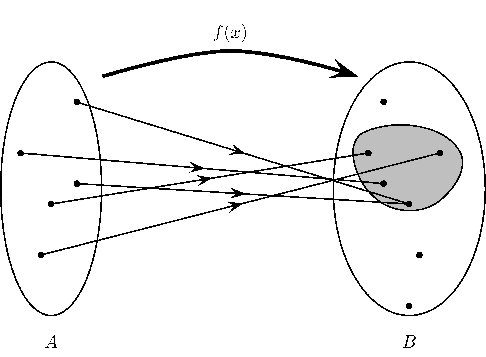
```

Jusqu'à maintenant, nous avons étudié les fonctions ayant comme domaine un sous-ensemble de la droite des réels. Dans ce cours, nous étudierons des fonctions ayant comme domaine un sous-ensemble $\mathbb{R}^n$, où $n\in\mathbb{N}$. En langage mathématique, ces fonctions s'écrivent:
\begin{align*}
f: D\subseteq \mathbb{R}^n &\longrightarrow \mathbb{R}\\
(x_1,..,x_n)&\longrightarrow z=f(x_1,..,x_n)
\end{align*}
où $x_1$, ..., $x_n$ sont $n$ variables indépendantes.

## Graphique {#graphiques-divers}

Lorsque nous avons une fonction $y=f(x)$, son graphe correspond à une courbe dans le plan cartésien, c'est-à-dire dans $\mathbb{R}^2$. Pour parvenir à dessiner cette courbe, on fait correspondre une valeur de $y$ pour chaque valeur de $x$.

Lorsque nous somme en présence d'une fonction de deux variables $z=f(x,y)$, le graphique de cette fonction est une surface dans l'espace de trois dimensions, $\mathbb{R}^3$.

Par contre, lorsque notre fonction possède plus de deux variables, il devient difficile, voire impossible de la représenter graphiquement. Il faudrait utiliser des espaces de plus de trois dimensions.

```{remark}
Dans le cadre de ce cours, nous nous en tiendrons à des fonctions de une, deux ou trois variables.
```

La figure \@ref(fig:point3d) montre de quelle façon nous pouvons représenter le point (a,b,f(a,b)) dans l'espace à trois dimensions.

```{r point3d,echo=FALSE,fig.align="center",label="point3d",out.width="75%",fig.cap="Représentation en trois dimensions d'un point."}
knitr::include_graphics("resources/images/latex/point3d.png")
## 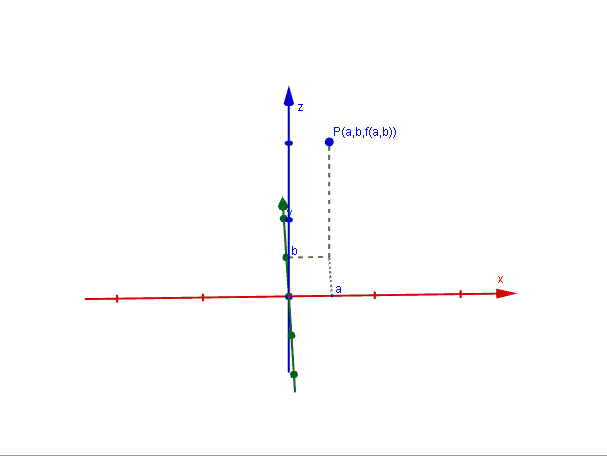
```

Nous allons maintenant présenter plusieurs fonctions accompagnées de leur graphique.

```{r graphiques, echo=FALSE}
xy <- meshgrid(linspace(-3,3,25))
x <- xy$X
y <- xy$Y
plan <- 1-x-y
paraboloide <- x^2+y^2
hyperboloide <- (x^2-y^2)/2
cone <- sqrt(x^2+y^2)
```

Les figures suivantes représentent des fonctions usuelles que nous rencontrerons régulièrement dans le cours.

```{r ,echo=FALSE,fig.align="center",label="plan",out.width="80%",fig.cap="Plan: $z=1-x-y$"}
if (knitr:::is_html_output()){
  plot_ly(x=x,y=y,z=plan, showscale=FALSE) %>% add_surface()
} else {
  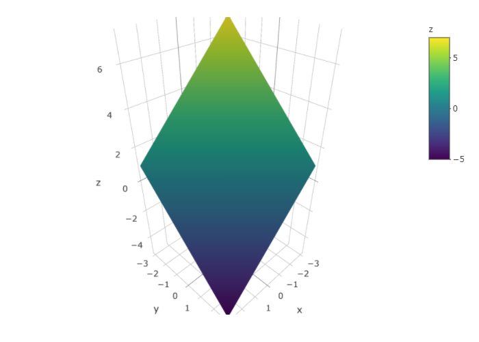
}
```

```{r ,echo=FALSE,fig.align="center",label="paraboloide",out.width="80%",fig.cap="Paraboloïde: $z=x^2+y^2$"}
if (knitr:::is_html_output()){
  plot_ly(x=x,y=y,z=paraboloide, showscale=FALSE) %>% add_surface()
} else {
  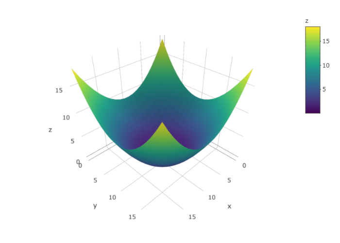
}
```

```{r ,echo=FALSE,fig.align="center",label="hyperboloide",out.width="80%",fig.cap="Hyperboloïde : $z=(x^2-y^2)/2$"}
if (knitr:::is_html_output()){
  plot_ly(x=x,y=y,z=hyperboloide, showscale=FALSE) %>% add_surface()
} else {
  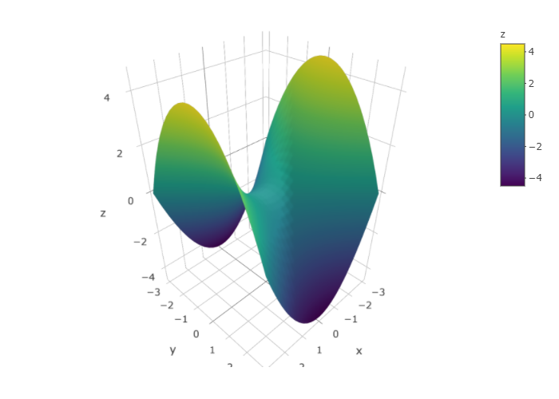
}
```

```{r ,echo=FALSE,fig.align="center",label="cone",out.width="80%",fig.cap='Cône : $z=\\sqrt{x^2+y^2}$'}
if (knitr:::is_html_output()){
  plot_ly(x=x,y=y,z=cone, showscale=FALSE) %>% add_surface()
} else {
  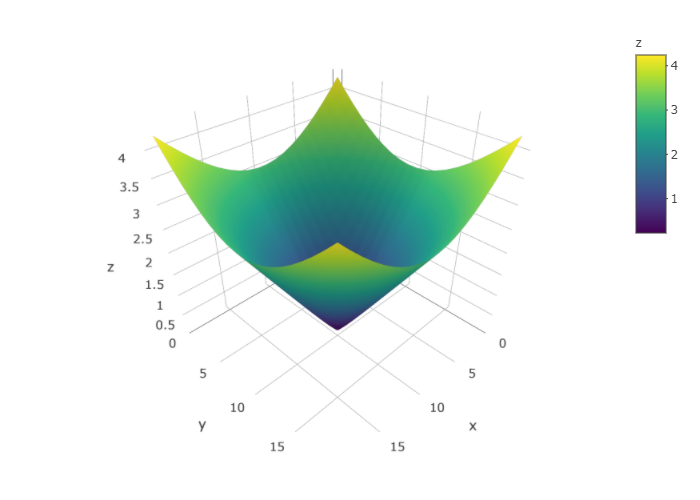
}
```

```{r surfaces,echo=FALSE}
delta <- 0.2
theta <- seq(-pi/2-delta, pi/2+delta, by=delta)
phi <- seq(0, 2*pi+delta, by=delta)
mgrd <- meshgrid(phi, theta)
phi <- mgrd$X
theta <-  mgrd$Y
xs <- cos(theta)*cos(phi)
ys <- cos(theta)*sin(phi)
zs <- sin(theta)

xe <- cos(theta) * cos(phi) * 2
ye <- cos(theta) * sin(phi) * 3
ze <- sin(theta) * 1

a <- 2
c <- 3
u <- seq(-2, 2, by = delta)
v <- seq(0-delta, 2*pi+delta, by = delta)
mgrd <- meshgrid(u,v)
u <- mgrd$X
v <- mgrd$Y
xh1 <- a*sqrt(1+u^2)*cos(v)
yh1 <- a*sqrt(1+u^2)*sin(v)
zh1 <- c*u

a <- 1
c <- 2
u <- seq(-2, 2, by = delta)
v <- seq(0-delta, 2*pi+delta, by = delta)
mgrd <- meshgrid(u,v)
u <- mgrd$X
v <- mgrd$Y
xhh1 <- a*sinh(u)*cos(v)
yhh1 <- a*sinh(u)*sin(v)
zhh1 <- c*cosh(u)
zhh2 <- -zhh1

r <- 1
a <- 2
delta <- 0.2
u <- seq(0-delta, 2*pi+delta, by = delta)
v <- seq(0-delta, 2*pi+delta, by = delta)
mgrd <- meshgrid(u,v)
u <- mgrd$X
v <- mgrd$Y
xt <- (a+r*cos(u))*cos(v)
yt <- (a+r*cos(u))*sin(v)
zt <- r*sin(u)
```


```{r ,echo=FALSE,fig.align="center",label="sphere",out.width="80%",fig.cap='Sphère: $x^2+y^2+z^2=R^2$'}
if (knitr:::is_html_output()){
  plot_ly(x=xs, y=ys, z=zs, type="surface",showscale=FALSE)
} else {
  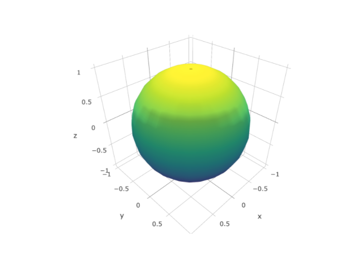
}
```

```{r ,echo=FALSE,fig.align="center",label="ellipse",out.width="80%",fig.cap='Ellipse: $\\dfrac{x^2}{a^2}+\\dfrac{y^2}{b^2}+\\dfrac{z^2}{c^2}=1$'}
if (knitr:::is_html_output()){
  plot_ly(x=xe, y=ye, z=ze, type="surface", showscale=FALSE)
} else {
  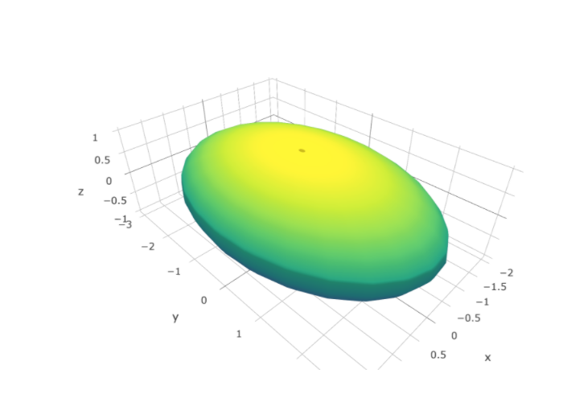
}
```

```{r ,echo=FALSE,fig.align="center",label="hyper1nappe",out.width="80%",fig.cap='Hyperboloïde à une nappe: $\\dfrac{x^2}{a^2}+\\dfrac{y^2}{b^2}-\\dfrac{z^2}{c^2}=1$'}
if (knitr:::is_html_output()){
  plot_ly(x=xh1, y=yh1, z=zh1, type="surface",showscale=FALSE)
} else {
  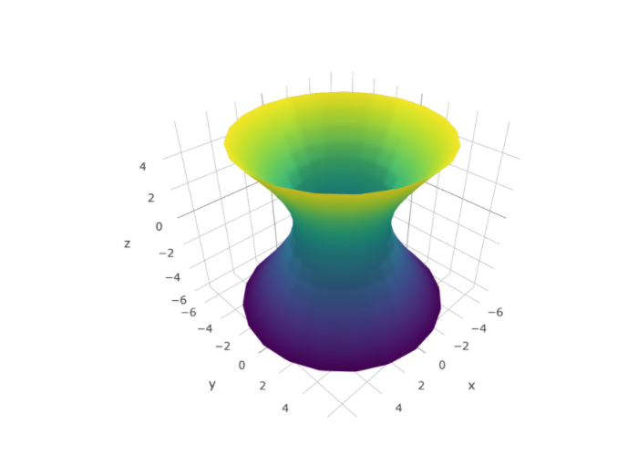
}
```

```{r ,echo=FALSE,fig.align="center",label="hyper2nappe",out.width="80%",fig.cap='Hyperboloïde à deux nappes: $-\\dfrac{x^2}{a^2}-\\dfrac{y^2}{b^2}+\\dfrac{z^2}{c^2}=1$'}
if (knitr:::is_html_output()){
  plot_ly(x=xhh1, y=yhh1,showscale=FALSE) %>% 
    add_surface(z = zhh1) %>% 
    add_surface(z = zhh2)
} else {
  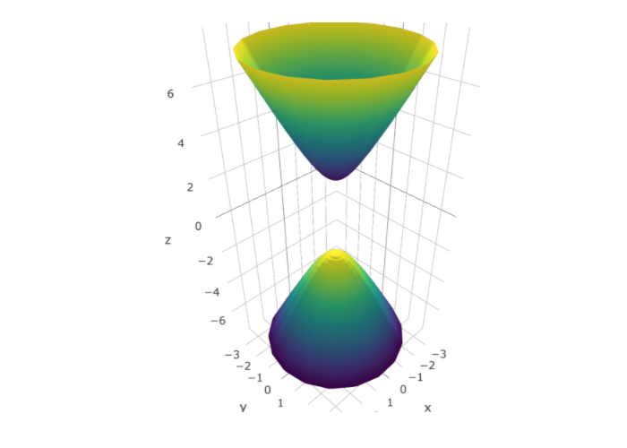
}
```

```{r ,echo=FALSE,fig.align="center",label="tore",out.width="80%",fig.cap='Tore: $(x^2+y^2+z^2+a^2-r^2)^2=4 a^2(x^2+y^2)$'}
if (knitr:::is_html_output()){
  plot_ly(x=xt, y=yt, z=zt, type="surface",showscale=FALSE)
} else {
  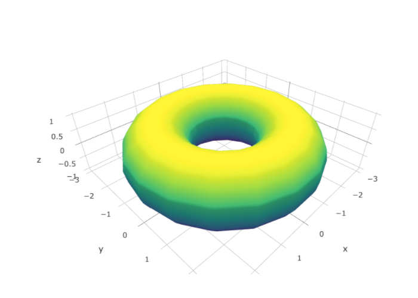
}
```

## Comment étudier les graphiques de fonctions de deux variables

Comme vous avez pu voir dans les figures précédentes de la section \@ref(graphiques-divers), les surfaces en trois dimensions peuvent être complexes et difficiles à dessiner à la main. Pour tenter  de nous aider à représenter graphiquement ces fonctions, nous allons introduire deux nouveaux outils: les coupes transversales et les courbes de niveaux.

```{remark}
Lorsque vous vous trouvez dans la version en ligne de ce document et que vous placez le curseur de votre souris sur les figures précédentes, vous devriez apercevoir des lignes et des courbes noires, centrées sur votre curseur. Ces lignes et courbes correspondent aux coupes transversales et aux courbes de niveaux.
```

### Les coupes transversales

L'idée des coupes transversales est de fixer la valeur de l'une des deux variables indépendantes. À ce moment, nous observons la fonction dans le plan où est fixé la variable. Si nous fixons $x=k$ où $k\in\mathbb{R}$, nous coupons la surface avec le plan $x=k$. Nous étudions donc une courbe dans le plan $x=k$ et cette courbe se trouve dans un espace à deux dimensions.

Pour bien visualiser les coupes transversales, nous vous invitons à utiliser l'application [GeoGebra](https://www.geogebra.org/?lang=fr) de la section \@ref(geogebra-fctvar).

```{r,echo=FALSE}
mshgrd <- meshgrid(seq(-3,3,by=0.2),seq(-3,3,by=0.2))
xs <- mshgrd$X
ys <- mshgrd$Y
zs <- (xs^2+ys)/10*3

mshplan <-  meshgrid(rep(-1,31))
xp1 <- mshplan$X
yp1 <- mshgrd$X
zp1 <- mshgrd$Y

mshplan <-  meshgrid(rep(1,31))
xp2 <- mshgrd$X
yp2 <- mshplan$X
zp2 <- mshgrd$Y
```

```{example}
Dessinez les coupes transversales de la fonction $z=f(x,y)=x^2+y$.
```

La figure \@ref(fig:fctcoupe) représente la fonction $f(x,y)$.

```{r ,echo=FALSE,fig.align="center",label="fctcoupe",out.width="80%",fig.cap='Graphique de $f(x,y)=x^2+y$'}
if (knitr:::is_html_output()){
  plot_ly(x=xs, y=ys, z=zs, type="surface",showscale=FALSE)
} else {
  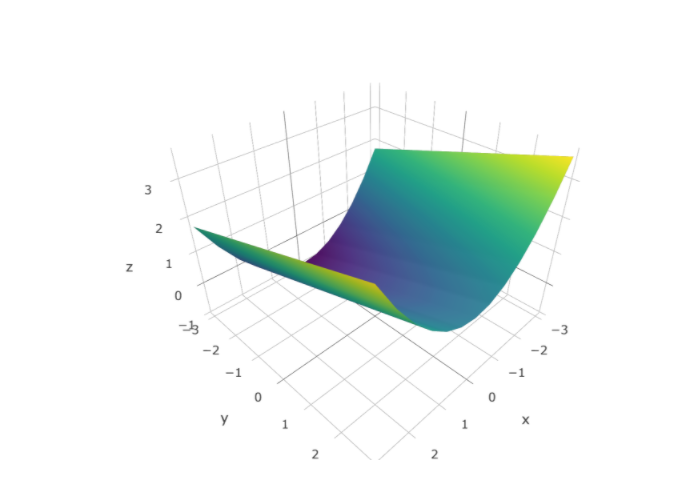
}
```

Déterminons tout d'abord les familles de courbes obtenues lorsque nous fixons la valeur de la variable $x$. Posons $x=k$ où $k$ est une constante. Ainsi $f(k,y)=z=k^2+y$. Donc dans le plan $x=k$, l'allure de la fonction est une droite d'équation $z=y+k^2$, comme on peut le voir à la figure \@ref(fig:fctcoupe1).

```{r ,echo=FALSE,fig.align="center",label="fctcoupe1",out.width="80%",fig.cap='Graphique de $f(x,y)=x^2+y$ et du plan $x=-1$'}
if (knitr:::is_html_output()){
  plot_ly(x=xs,y=ys,z=zs,type="surface",showscale=FALSE) %>% 
    add_surface(x=xp1,y=yp1,z=zp1)
} else {
  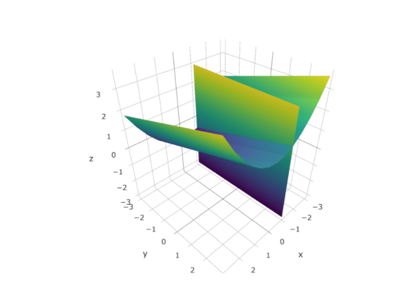
}
```

Déterminons maintenant les familles de courbes obtenues lorsque nous fixons la valeur de la variable $y$. Posons $y=k$ où $k$ est une constante. Ainsi $f(x,k)=z=x^2+k$. Donc dans le plan $y=k$, l'allure de la fonction est une parabole d'équation $z=x^2+k$, comme on peut le voir à la figure \@ref(fig:fctcoupe2).

```{r ,echo=FALSE,fig.align="center",label="fctcoupe2",out.width="80%",fig.cap='Graphique de $f(x,y)=x^2+y$ et du plan $y=1$'}
if (knitr:::is_html_output()){
  plot_ly(x=xs,y=ys,z=zs,type="surface",showscale=FALSE) %>% 
    add_surface(x=xp2,y=yp2,z=zp2)
} else {
  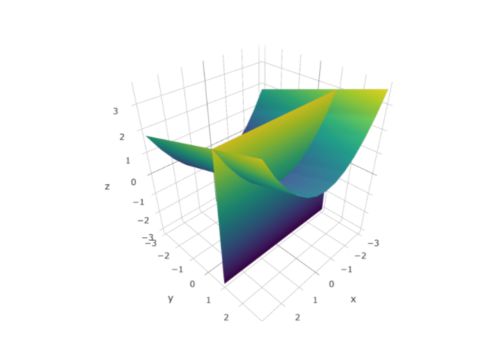
}
```

### Les courbes de niveaux

```{definition,name="Courbes de niveaux"}
Soit une fonction définie par $z=f(x,y)$ et $k\in\mathbb{R}$. La courbe de niveau $k$ correspond à l'ensemble des points $(x,y)$ tels que $f(x,y)=k$.
```

```{remark}
Les courbes de niveaux correspondent donc à une coupe transversale de la fonction lorsque nous fixons la variable dépendante.
```


> La fonction est constante le long de ses courbes de niveaux.

Les applications les plus répandues des courbes de niveaux sont dans les cartes topographiques. Une carte topographique est une carte à échelle réduite représentant le relief déterminé par altimétrie et les aménagements humains d'une région géographique de manière précise et détaillée sur un plan horizontal. La figure \@ref(fig:montgreg) représente une carte topographique du Mont Saint-Grégoire. Dans la version en ligne de ce document, vous pouvez vous déplacer dans la carte et aller voir le relief topographique ailleurs sur la planète.

```{r ,echo=FALSE,fig.align="center",label="montgreg",out.width="80%",fig.cap='Carte topographique du Mont Saint-Grégoire'}
leaflet() %>%
  addTiles(urlTemplate="//{s}.tile.opentopomap.org/{z}/{x}/{y}.png") %>% 
  addMarkers(lat = 45.357059, lng = -73.147859, popup = "Mont Saint-Grégoire")
```

Un autre exemple de carte topographique peut être obtenu en utilisant des données topographiques du volcan __Maunga Whau__ situé dans la région d'Auckland. Les données sont distribuées sur une grille de 10 mètres par 10 mètres. La figure \@ref(fig:volcano3d) représente le volcan en trois dimensions.

```{r, echo=FALSE,fig.align="center",label="volcano3d",out.width="80%",fig.cap='Représentation du volcan Maunga Whau'}
if (knitr:::is_html_output()){
  plot_ly(z=~volcano,type="surface",showscale=FALSE)
} else {
  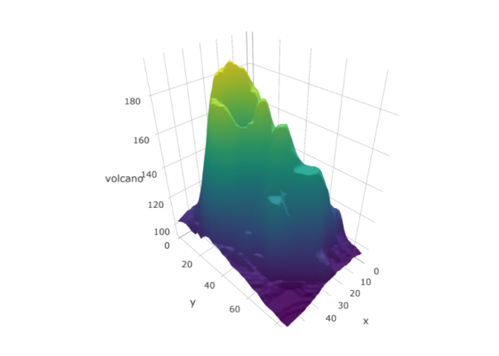
}
```

Nous pouvons représenter les courbes de niveaux de ce volcan comme à la figure \@ref(fig:volcano2d).

```{r, echo=FALSE,fig.align="center",label="volcano2d",out.width="80%",fig.cap='Courbes de niveaux du volcan Maunga Whau'}
if (knitr:::is_html_output()){
  plot_ly(z=~volcano,type="contour")
} else {
  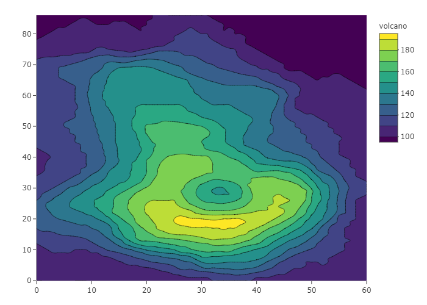
}
```

Faisons maintenant quelques exemples.

```{example}
Déterminez la nature des courbes de niveaux du paraboloïde $f(x,y)=x^2+y^2$. Dessinez quelques courbes de niveaux.
```
\vspace*{6cm}

```{example}
Trouvez les courbes de niveaux de la fonction $f(x,y)=x^2-y$.
```
\vspace*{6cm}

```{example}
Trouvez les courbes de niveaux de la fonction $f(x,y)=ye^{-|x|}$.
```
\vspace*{6cm}

```{example}
Trouvez les courbes de niveaux de la fonction $f(x,y)=e^{x^2-y^2}$.
```
\vspace*{6cm}

```{example}
Trouvez les courbes de niveaux de la fonction $f(x,y)=\ln(4-x^2-4y^2)$.
```
\vspace*{6cm}


## Domaine

```{definition,name="Domaine d'une fonction"}
Le domaine d'une fonction réelle $f(x_1,\ldots,x_n)$ (ou domaine de définition d'une fonction),  noté $\text{dom} f$,  est un sous ensemble de $\mathbb{R^n}$ qui contient toutes les valeurs de $x_i$ avec $i=1,\ldots, n$, pour lesquelles la règle de correspondance de $f(x_1,\ldots,x_n)$ est définie. 
```

Pour déterminer le domaine d'une fonction réelle $f(x_1,\ldots,x_n)$,  il suffit de suivre les étapes suivantes:

  1. Vérifier si $f(x_1,\ldots,x_n)$ est définie dans un contexte, afin de voir si celui-ci restreint les valeurs des variables indépendantes.
  1. Enlever les valeurs des variables indépendantes qui annulent le dénominateur.
  1. L'argument des racines paires doit être plus grand ou égal à zéro, c'est-à-dire $\geq 0$.
  1. L'argument des logarithmes doit être __strictement__ plus grand que zéro, c'est-à-dire $> 0$.
  1. Les fonctions trigonométriques usuelles ont souvent des dénominateurs, par exemple $\tan$, $\cot$, $\csc$ et $\sec$. De plus, les fonctions trigonométriques inverses ont souvent des domaines restreints.
  
Voici quelques exemples.

```{example}
Déterminez le domaine des fonctions suivantes:
  
  a. $f(x,y)=x^2+y^2$
  a. $f(x,y)=\dfrac{1}{9-x^2-y^2}$
  a. $f(x,y)=\dfrac{\sqrt{9-x^2-y^2}}{x-y}$
  a. $f(x,y)=\ln(4-x^2-4y^2)$
  a. $f(x,y)=\sqrt{x^2+y^2-1}+\sqrt{4-x^2-y^2}$
  a. $f(x,y)=\sqrt{x(1-|y|)}$
  a. $f(x,y)=\dfrac{xy}{x^2-y^2}$
  a. $f(x,y)=\dfrac{1}{\sqrt{x^2-y^2}}$
  
  
```
\vspace*{20cm}

## Limites

Nous allons débuter en rappelant la définition de la limite d'une fonction à une variable.

```{definition, name="Limite d'une fonction à une variable"}
Soit une fonction $f(x)$. Nous disons que $L$ est la limite de $f(x)$ lorsque $x$ tend vers $a$ si pour tout $\epsilon >0$, il existe $\delta$ tel que si $|x-a|<\delta$ alors $|f(x)-L|<\epsilon$. Nous notons alors:
$$ \lim_{x\to a} f(x) = L $$


```

__WIP__

```{proposition, name="Les propriétés des limites"}
Soit $f(x,y)$ et $g(x,y)$ deux fonctions de deux variables.

\begin{align*}
& \lim_{(x,y)\to(a,b)}f(x,y)\pm g(x,y)=\lim_{(x,y)\to(a,b)}f(x,y)\pm \lim_{(x,y)\to(a,b)} g(x,y) \\
& \lim_{(x,y)\to(a,b)}f(x,y)\cdot  g(x,y)=\lim_{(x,y)\to(a,b)}f(x,y)\cdot \lim_{(x,y)\to(a,b)} g(x,y) \\
& \lim_{(x,y)\to(a,b)}\dfrac{f(x,y)}{g(x,y)}=\dfrac{\lim\limits_{(x,y)\to(a,b)}f(x,y)}{ \lim\limits_{(x,y)\to(a,b)} g(x,y)}\quad \text{si $g(x,y)\neq 0$ près de $(a,b)$}
\end{align*}


```

```{example}
Trouvez la limite suivante:

$$
\lim_{(x,y)\to(1,2)} (x^2+y)
$$

```

```{example, label="lim-sin-sur-x"}
Trouvez la limite suivante:

$$
\lim_{(x,y)\to(0,0)}\dfrac{\sin (x^2+y^2)}{x^2+y^2}
$$

```

Nous avons pu lever l'indétermination de l'exemple \@ref(exm:lim-sin-sur-x) en utilisant une limite vue dans un cours de calcul intégral. Malheureusement, il sera habituellement plus difficile de lever des indéterminations. En particulier, il n'existe pas d'analogue à la règle de L'Hospital pour des fonctions de deux variables ou plus. 

Nous verrons par contre deux techniques pour être en mesure de calculer des limites de fonctions de deux variables ou plus: la méthode des chemins et la méthode du gendarme.

### La méthode des chemins

Cette méthode est une généralisation du principe de la limite à droite et de la limite à gauche. Lorsque nous avons:

$$ \lim_{x\to a} f(x) $$

cela signifie que la valeur de $x$ s'approche de $a$. La variable $x$ peut s'approcher de $a$ de deux façons différentes, par la droite ou par la gauche. Dans le cas de la limite suivante:

$$ \lim_{(x,y)\to (a,b)} f(x,y) $$

cela signifie que nous devons nous approcher du point $(a,b)$. Par contre, il existe plus de deux façons de se rendre au point $(a,b)$. Il en existe en fait une infinité! La figure \@ref(fig:limites2d-3d) présente une représentation d'une limite pour une fonction d'une seule variable dans la figure de gauche. Dans la figure de droite, nous montrons trois chemins possibles, parmi l'infinité de chemins possibles.

```{r, echo=FALSE,fig.align="center",label="limites2d-3d",out.width="45%",fig.cap="Représentation d'une limite en deux dimensions et d'une autre en trois dimensions.",fig.show='hold'}
knitr::include_graphics(c("resources/images/latex/limite2d.png", "resources/images/latex/limite3d.png"))
```

```{example}
Déterminez, si elle existe, la limite suivante:
  
$$ \lim_{(x,y)\to (0,0)}\dfrac{x^2}{x^2+y^2} $$

```

En général, nous désirons trouver la limite en $(0,0)$ et nous allons tester les chemins suivants:

- $x=0$
- $y=0$
- $y=x$
- $y=kx$ où $k$ est une constante
- $y=kx^2$ où $k$ est une constante

```{remark}
La méthode des chemins ne permet que de démontrer qu'une limite __n'existe pas__.
```


```{example}
Déterminez, si elle existe, la limite suivante:
  
$$ \lim_{(x,y)\to (0,0)}\dfrac{xy}{x^2+y^2} $$

```

```{example}
Déterminez, si elle existe, la limite suivante:
  
$$ \lim_{(x,y)\to (0,0)}\dfrac{xy^2}{x^2+y^4} $$

```

```{example}
Déterminez, si elle existe, la limite suivante:
  
$$ \lim_{(x,y)\to (0,0)}\dfrac{x^2+y^2}{y} $$

```

### La méthode des gendarmes

Puisque la méthode des chemins ne nous permet pas de démontrer qu'une limite existe, nous allons introduire la méthode des gendarmes, qui elle permet de démontrer qu'une limite existe. Nous débutons pas utiliser la méthode des chemins pour calculer la limite:

$$ \lim_{(x,y)\to (a,b)}f(x,y) $$

Si tous les chemins nous donnent une limite égale à $L$, nous pouvons présumer que:

$$ \lim_{(x,y)\to (a,b)}f(x,y)=L $$

Nous voulons maintenant trouver une fonction $M(x,y)$ telle que:

$$ 0 \leq |f(x,y)-L| \leq M(x,y) $$

et telle que la limite suivante est vérifiée:

$$ \lim_{(x,y)\to (a,b)} M(x,y) = 0 $$

Nous nous retrouvons donc dans la situation suivante:

\begin{align*}
0 &\leq |f(x,y)-L| &\leq M(x,y) \\
\lim_{(x,y)\to (a,b)} 0 &\leq \lim_{(x,y)\to (a,b)}|f(x,y)-L| &\leq \lim_{(x,y)\to (a,b)}M(x,y) \\
0 &\leq \lim_{(x,y)\to (a,b)}|f(x,y)-L| &\leq 0
\end{align*}

Nous pouvons donc conclure que:

$$ \lim_{(x,y)\to (a,b)}f(x,y)=L $$

Pour utiliser la méthode des gendarmes, nous utiliserons à plusieurs reprises l'inégalité suivante.

```{proposition}
Soit $x$ et $y$ deux nombres réels. Nous avons:
\begin{align*}
\left|\dfrac{x^2}{x^2+y^2}\right| &\leq 1 \\
\left|\dfrac{y^2}{x^2+y^2}\right| &\leq 1
\end{align*}


```
```{proof}
Nous avons:
\begin{align*}
x^2 &\leq x^2+y^2 \\
\dfrac{x^2}{x^2+y^2} &\leq 1
\end{align*}
L'autre inégalité se démontre de la même manière.
```


```{example}
Trouvez la limite suivante:
$$ \lim_{(x,y)\to (0,0)}\dfrac{x^2y}{x^2+y^2} $$
  
  
```

```{example}
Trouvez la limite suivante:
$$ \lim_{(x,y)\to (0,0)}\dfrac{y^3}{x^2+y^2} $$
  
  
```


### Exercises divers de limites

```{example}
Trouvez, si possible, les limites suivantes:

a. $\lim_{(x,y)\to (2,-1)} (xy+y^2)$
a. $\lim_{(x,y)\to (0,0)} \sqrt{x^2+y^2}$
a. $\lim_{(x,y)\to (0,0)} \dfrac{x}{x^2+y^2}$
a. $\lim_{(x,y)\to (0,0)} \dfrac{\cos(xy)}{1-x-\cos(y)}$
a. $\lim_{(x,y)\to (0,1)} \dfrac{x^2(y-1)^2}{x^2+(y-1)^2}$
a. $\lim_{(x,y)\to (0,0)} \dfrac{\sin(x-y)}{\cos(x+y)}$
a. $\lim_{(x,y)\to (0,0)} \dfrac{\sin(xy)}{x^2+y^2}$


```

## La continuité

La notion de continuité pour les fonctions de plusieurs variables est similaire à celle des fonctions d'une seule variable.

```{definition, name="Continuité pour les fonctions de deux variables"}
Soit une fonction $f(x,y)$ et un point $(a,b)\in\text{dom} f$. Nous disons que $f(x,y)$ est continue au point $(a,b)$ si:
$$ \lim_{(x,y)\to (a,b)} f(x,y) = f(a,b) $$


```

> Cette définition se généralise facilement aux fonctions de trois variables ou plus.

```{example}
Déterminez si la fonction suivante:
  
$$ 
f(x,y) = \begin{cases}
\dfrac{x^2y}{x^2+y^2} & \text{si } (x,y)\neq (0,0) \\
0 & \text{si } (x,y)= (0,0)
\end{cases}
$$
est continue en $(0,0)$.
```

```{example}
Comment la fonction $f(x,y)=\dfrac{x^2+y^2-x^3y^3}{x^2+y^2}$ définie pour tous les $(x,y)\neq (0,0)$ peut-elle être définie à l'origine pour qu'elle soit continue partout sur $\mathbb{R}^2$?
```

```{example}
Comment la fonction $f(x,y)=\dfrac{x^3-y^3}{x-y}$ définie pour tous les $x\neq y$ peut-elle être définie à l'origine pour qu'elle soit continue partout sur $\mathbb{R}^2$?
```

```{example}
Déterminez si la fonction suivante:
  
$$ 
f(x,y) = \begin{cases}
\sin\left(\dfrac{x}{y}\right) & \text{si } x\neq 0 \text{ et } y\neq 0 \\
1 & \text{si } x= 0 \text{ et } y= 0
\end{cases}
$$
est continue en $(0,0)$.
```

## Geogebra {#geogebra-fctvar}

<script type="text/javascript" src="https://cdn.geogebra.org/apps/deployggb.js"></script>
<script type="text/javascript">
var parameters = {
"appName":"graphing",
"material_id":"ms6jdhhg",
"width":800,
"height":600,
"showToolBar":true,
"borderColor":null,
"showMenuBar":true,
"showFullscreenButton":true,
"enableShiftDragZoom":true};

var applet = new GGBApplet(parameters, 'applet_container');
window.onload = function() { applet.inject('applet_container'); updateHelp('AG');}
</script>
<div id="applet_container"></div>

\newpage
## Pages supplémentaires

Des pages blanches supplémentaires pour ajouter, potentiellement, de nouveaux exemples et exercices.

<!-- Code pour insérer des pages blanches dans le document pdf pour des exemples supplémentaires. -->

\multido{\i=1+1}{4}{
\newpage
\mbox{}
}
