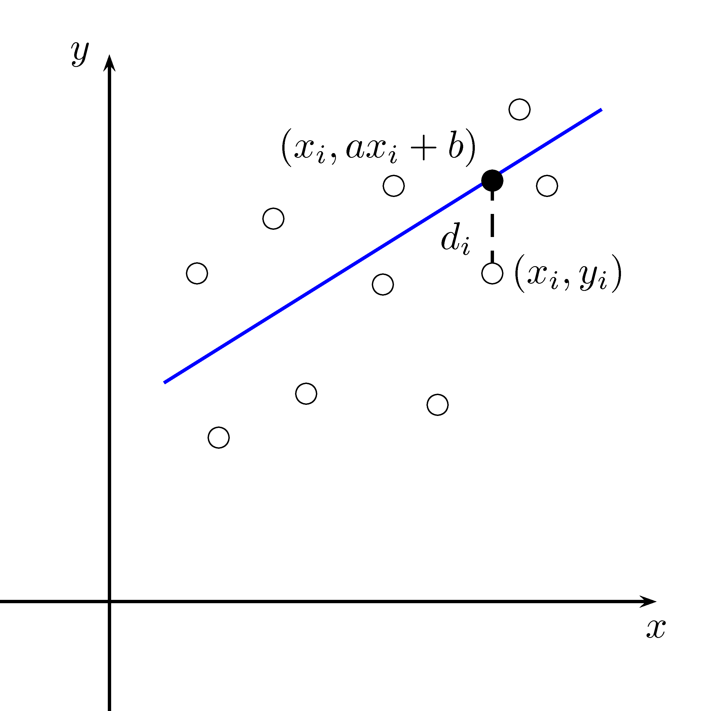
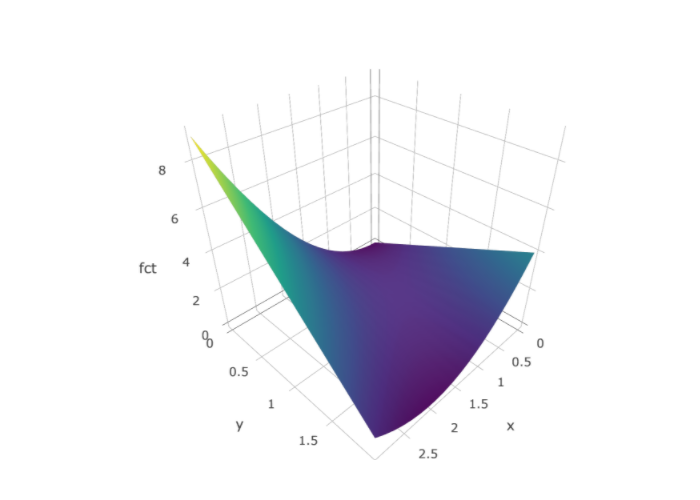

# L'optimisation {#optimisation}

```{r,echo=FALSE,message=FALSE,warning=FALSE}
library(pracma)
library(plotly)
library(tidyverse)
library(knitr)
library(ggplot2)
library(datasauRus)
```

Vous trouverez à la section  une application [GeoGebra](https://www.geogebra.org/?lang=fr) vous permettant de visualiser des coupes transversales et des courbes de niveaux. À noter que cette application n'est disponible que dans la version en ligne de ce document.

## Introduction

La théorie de l'optimisation des fonctions de plusieurs variables est très vaste. Nous introduirons ce sujet sans aller trop en profondeur. Faire de l'optimisation consiste à déterminer les maximums et les minimums d'une fonction.

## L'approximation quadratique

Nous voulons approcher une fonction $f(x,y)$ autour d'un point $(x_0,y_0)$ par un paraboloïde. Ceci correspond à l'analogue de l'approximation d'une fonction par un polynôme de Taylor de degré 2. Nous pouvons montrer que le paraboloïde recherché est donné par:

\begin{equation}
\begin{split}
Q(x,y) &= f(x_0,y_0)+f_x(x_0,y_0)(x-x_0)+f_y(y-y_0)+ \\
&\qquad \dfrac{1}{2!}[f_{xx}(x_0,y_0)(x-x_0)^2+2f_{xy}(x_0,y_0)(x-x_0)(y-y_0) \\
& \qquad \qquad +f_{yy}(x_0,y_0)(y-y_0)^2]
\end{split}
(\#eq:approx-quadratique)
\end{equation}

Nous utiliserons l'équation \@ref(eq:approx-quadratique) pour démontrer la nature des points critiques d'une fonction de deux variables.

## Les points critiques et leur nature

```{definition}
Soit une fonction $f:D_{\alpha}\subseteq \mathbb{R}^2 \rightarrow \mathbb{R}$. Nous disons que le point $(x_0,y_0)$ est un point de maximum __local__ si pour tous les points $(x,y)$ dans le voisinage de $(x_0,y_0)$, nous avons que:
$$ f(x,y) \leq f(x_0,y_0) $$
De manière similaire, le point $(x_0,y_0)$ est un point de minimum __local__ si pour tous les points $(x,y)$ dans le voisinage de $(x_0,y_0)$, nous avons que:
$$ f(x,y) \geq f(x_0,y_0) $$
Le __maximum absolu__ de $f$ est la valeur maximale de $f$ sur $D$ et le __minimum absolu__ de $f$ est la valeur minimale de $f$ sur $D$.
```

```{theorem, label="gradient-max-min"}
Soit une fonction $z=f(x,y)$ différentiable autour du point $(x_0,y_0)$. Si le point $(x_0,y_0)$ est un maximum ou minimum local de $f$, alors:
$$ \nabla f(x_0,y_0)=\overrightarrow{0} $$

```
```{proof}
Nous savons que si une fonction d'une seule variable possède un minimum ou un maximum en $x_0$, alors la dérivée évaluée en ce point est nulle.

Maintenant, supposons que $(x_0,y_0)$ est un point de maximum (la démonstration pour le cas d'un minimum est similaire). Si nous fixons $x=x_0$, nous avons une fonction d'une seule variable $g(y)=f(x_0,y)$. Cette fonction possède un maximum lorsque $y=y_0$. Nous avons donc que $g'(y_0)=0$. Mais $g'(y_0)=f_y(x_0,y_0)=0$.

D'une manière similaire, nous avons que $f_x(x_0,y_0)=0$. D'où $\nabla f(x_0,y_0)=\overrightarrow{0}$.

```

```{remark}
Il est important de remarquer que le théorème \@ref(thm:gradient-max-min) n'est pas un __si et seulement si__. C'est-à-dire que si $(x_0,y_0)$ est un maximum (ou un minimum), alors le gradient en ce point est nul.

L'inverse n'est pas nécessairement vrai, c'est-à-dire que si le gradient en un point est nul, il est possible que le point ne soit ni un maximum, ni un minimum.
```

Pour spécifier la nature d'un point critique, nous aurons besoin d'un test supplémentaire.

```{theorem, label="test-derivee-seconde"}
Soit une fonction $z=f(x,y)$ possédant un point critique en $(x_0,y_0)$. Soit le scalaire:
$$ D=f_{xx}(x_0,y_0)\cdot f_{yy}(x_0,y_0)-\left(f_{xy}(x_0,y_0) \right)^2 $$
Nous pouvons rencontrer les quatres situations suivantes:

- Si $D>0$ et $f_{xx}(x_0,y_0)>0$ alors $(x_0,y_0)$ est un point de maximum
- Si $D>0$ et $f_{xx}(x_0,y_0)<0$ alors $(x_0,y_0)$ est un point de minimum
- Si $D<0$ alors $(x_0,y_0)$ est un point de selle
- Si $D=0$ alors nous ne pouvons rien conclure

```
```{proof}
Pour simplifier la résolution, nous allons poser $A=f_{xx}(x_0,y_0)$, $B=f_{xy}(x_0,y_0)$ et $C=f_{yy}(x_0,y_0)$. Nous allons utiliser l'approximation quadratique trouvée à l'équation \@ref(eq:approx-quadratique), pour trouver une expression pour $f(x,y)-f(x_0,y_0)$ si $(x,y)$ est près de $(x_0,y_0)$.

Par l'équation \@ref(eq:approx-quadratique) et puisque $f_x(x_0,y_0)=f_y(x_0,y_0)=0$, car $(x_0,y_0)$ est un point critique, nous avons:
$$ f(x,y)-f(x_0,y_0)=\dfrac{A}{2}(x-x_0)^2+B(x-x_0)(y-y_0)+\dfrac{C}{2}(y-y_0)^2 $$

Ainsi, le signe de $f(x,y)-f(x_0,y_0)$ sera le même que celui du membre de droite de l'expression précédente. Nous allons diviser le membre de droite par $\dfrac{1}{2}(y-y_0)^2$. Cette division ne changera pas le signe. Par la suite posons $w=\dfrac{x-x_0}{y-y_0}$.

Nous obtenons une nouvelle expression, que nous noterons $E$:
$$ E = Aw^2+2Bw+C $$
L'expression $E$ est un polynôme de degré 2 par rapport à $w$. Étudions maintenant le signe de $E$.

Nous avons que $E=0$ si:
$$ \dfrac{-2B\pm\sqrt{4B^2-4AC}}{2A}=\dfrac{-B\pm\sqrt{B^2-AC}}{A} $$

Si $B^2-AC<0$ ou $D=AC-B^2>0$ alors $E$ ne possède pas de zéros. Ceci implique que $f(x,y)-f(x_0,y_0)$ ne change pas de signe. Ainsi  $f(x,y)$ est toujours plus grand ou plus petit que $f(x_0,y_0)$, pour tout $(x,y)$ près de $(x_0,y_0)$. C'est la définition d'un maximum ou d'un minimum.

Pour déterminer si nous sommes en présence d'un maximum ou d'un minimum, nous allons étudier le signe de $A$. Si $A<0$, nous avons une concavité vers le bas, donc un maximum. Si $A>0$, nous avons une concavité vers le haut, donc un minimum.

Si $B^2-AC>0$ ou $D=AC-B^2<0$, nous avons deux racines et donc $f(x,y)-f(x_0,y_0)$ change de signe. C'est ce que nous appelons un point de selle.
```

Nous pouvons voir un point de selle en observant la figure \@ref(fig:hyperboloide1). Le point situé à l'origine est un point de selle. Dans une direction, la concavité de la fonction est vers le haut et elle est vers le bas dans l'autre direction.

```{r ,echo=FALSE,fig.align="center",label="hyperboloide1",out.width="80%",fig.cap="Hyperboloïde : $z=(x^2-y^2)/2$"}
if (knitr:::is_html_output()){
  xy <- meshgrid(linspace(-3,3,20))
  x <- xy$X
  y <- xy$Y
  hyperboloide <- (x^2-y^2)/2
  plot_ly(x=x,y=y,z=~hyperboloide, type="surface", showscale=FALSE)
} else {
  knitr::include_graphics("resources/images/hyperboloide.png")
}
```

```{example}
Déterminez tous les points critiques de la fonction $f(x,y)=x^2-y^2$ et donnez leur nature.
```
\vspace*{8cm}

```{example}
Déterminez tous les points critiques de la fonction $f(x,y)=x^4+y^4-4xy+1$ et donnez leur nature.
```
```{r ,echo=FALSE,fig.align="center",label="fct-pt-critique",out.width="80%",fig.cap="Graphique de $f(x,y)=x^4+y^4-4xy+1$"}
if (knitr:::is_html_output()){
  xy <- meshgrid(linspace(-3,3,25))
  x <- xy$X
  y <- xy$Y
  fct <- x^4+y^4-4*x*y+1
  plot_ly(x=x,y=y,z=~fct, type="surface",showscale=FALSE)
} else {
  knitr::include_graphics("resources/images/fct_pt_critique.png")
}
```
\vspace*{8cm}

```{example}
Déterminez tous les points critiques de la fonction $f(x,y)=2x^3-6xy+3y^2$ et donnez leur nature.
```
\vspace*{8cm}

```{example}
Déterminez tous les points critiques de la fonction $f(x,y)=xye^{-\frac{x^2+y^2}{2}}$.
```
\vspace*{8cm}

## La droite de régression

Supposons que nous ayons amassé $n$ couples de données $(x_i,y_i)$ pour $i\in \{1,2,\ldots, n\}$. Nous voulons déterminer l'équation de laa droite qui minimise la somme des carrés des distances verticales entre les points et cette droite. En d'autre mots, nous voulons trouver l'équation de la droite *la plus proche* du nuage de points. Cette situation est représentée à la figure \@ref(fig:droite-regression).

```{r,echo=FALSE,fig.align="center",label="droite-regression",out.width="50%",fig.cap="Nuage de points et droite de régression"}

```

Nous allons supposer que l'équation est de la forme $y=ax+b$ avec $a$ et $b$ que nous devons déterminer en minimisant la somme des carrés des distances verticales. Nous savons:

$$ d_i^2 = (y-y_i)^2 = (ax_i+b-y_i)^2 $$

Nous voulons minimiser la somme de toutes ces distances, c'est-à-dire:

\begin{equation}
\begin{split}
f(a,b) &= \sum_{i=1}^n d_i^2 \notag \\
&= \sum_{i=1}^n (ax_i+b-y_i)^2
\end{split}
(\#eq:somme-distances)
\end{equation}

Nous désirons trouver $a$ et $b$ tels qu'ils minimisent la fonction $f(a,b)$. Nous désirons en fait trouver les points critiques de $f$:

\begin{align}
\dfrac{\partial f}{\partial a} &= \sum_{i=1}^n 2x_i(ax_i+b-y_i) = 0 (\#eq:deriv1)\\
\dfrac{\partial f}{\partial b} &= \sum_{i=1}^n 2(ax_i+b-y_i) = 0 (\#eq:deriv2)
\end{align}

En utilisant l'équation \@ref(eq:deriv2), nous obtenons:

\begin{align}
\sum_{i=1}^n 2(ax_i+b-y_i) &= 0 \notag\\
\sum_{i=1}^n 2ax_i + \sum_{i=1}^n 2b - \sum_{i=1}^n 2y_i &= 0 \notag\\
b \sum_{i=1}^n 1 &= \sum_{i=1}^n y_i - a \sum_{i=1}^n x_i \notag\\
bn &= \sum_{i=1}^n y_i - a \sum_{i=1}^n x_i \notag\\
b &= \dfrac{\sum\limits_{i=1}^n y_i - a \sum\limits_{i=1}^n x_i}{n} (\#eq:valeurb)
\end{align}

Nous devons maintenant remplacer l'équation \@ref(eq:valeurb) dans l'équation \@ref(eq:deriv1).

\begin{align*}
\sum_{i=1}^n 2x_i(ax_i+b-y_i) &= 0 \\
a\sum_{i=1}^n x_i^2 + b \sum_{i=1}^n x_i - \sum_{i=1}^n x_iy_i &= 0 \\
a\sum_{i=1}^n x_i^2 + \left(\dfrac{\sum\limits_{i=1}^n y_i - a \sum\limits_{i=1}^n x_i}{n}\right) \sum_{i=1}^n x_i - \sum_{i=1}^n x_iy_i &= 0 \\
an\sum_{i=1}^n x_i^2+\left(\sum_{i=1}^n x_i\right)\left(\sum_{i=1}^n y_i\right)-a\left(\sum_{i=1}^n x_i\right)^2- \sum_{i=1}^n x_iy_i &= 0 \\
a\left(n\sum_{i=1}^n x_i^2-\left(\sum_{i=1}^n x_i\right)^2\right) &= \sum_{i=1}^n x_iy_i-\left(\sum_{i=1}^n x_i\right)\left(\sum_{i=1}^n y_i\right) \\
a &= \dfrac{\sum\limits_{i=1}^n x_iy_i-\left(\sum\limits_{i=1}^n x_i\right)\left(\sum\limits_{i=1}^n y_i\right)}{n\sum\limits_{i=1}^n x_i^2-\left(\sum\limits_{i=1}^n x_i\right)^2}
\end{align*}

En résumé, nous avons:

\begin{align*}
a &= \dfrac{\sum\limits_{i=1}^n x_iy_i-\left(\sum\limits_{i=1}^n x_i\right)\left(\sum\limits_{i=1}^n y_i\right)}{n\sum\limits_{i=1}^n x_i^2-\left(\sum\limits_{i=1}^n x_i\right)^2} \\
b &= \dfrac{\sum\limits_{i=1}^n y_i - a \sum\limits_{i=1}^n x_i}{n}
\end{align*}

En utilisant le théorème \@ref(thm:test-derivee-seconde), nous pourrions démontrer que ces valeurs de $a$ et $b$ minimisent la fonction $f$.

```{example}
Utilisez les données suivantes pour trouver la droite de régression associée au nuage de points de la figure \@ref(fig:anscombe1).
```
```{r, echo=FALSE}
anscombe %>% 
  select(x1, y1) %>% 
  rename(x = x1, y = y1) %>% 
  kable(booktabs=TRUE, align="c")
```

```{r,echo=FALSE,fig.align="center",fig.cap="Le nuage de points.",label="anscombe1"}
anscombe %>% 
  select(x1, y1) %>% 
  rename(x = x1, y = y1) %>% 
  ggplot(aes(x=x, y=y))+
  geom_point()
```
\vspace*{10cm}

### Le quartet d'Anscombe

Le quartet d'Anscombe est constitué de quatre ensembles de données qui ont les mêmes propriétés statistiques simples mais qui sont en réalité très différents, ce qui se voit facilement lorsqu'on les représente sous forme de graphiques. Ils ont été construits en 1973 par le statisticien Francis Anscombe dans le but de démontrer l'importance de tracer des graphiques avant d'analyser des données, car cela permet notamment d'estimer l'incidence des données aberrantes sur les différentes indices statistiques que l'on pourrait calculer.

Dans la table \@ref(tab:quartet-anscombe), les observations $x_i$ sont reliées aux observations $y_i$.

```{r quartet-anscombe,echo=FALSE}
kable(anscombe, booktabs=TRUE, align="c", caption="Le quartet d'Anscombe")
```

```{r echo = FALSE}
anscombe_tidy <- anscombe %>%
    mutate(observation = seq_len(n())) %>%
    gather(key, value, -observation) %>%
    separate(key, c("variable", "ensemble"), 1, convert = TRUE) %>%
    mutate(ensemble = c("I", "II", "III", "IV")[ensemble]) %>%
    spread(variable, value)
```

Avant d'afficher les ensembles de données, nous allons calculer quelques mesures sur chacun de ces ensembles, à savoir, la moyenne des $x$, la moyenne des $y$, la variance des $x$, la variance des $y$ et le coefficient de corrélation.

```{r, echo=FALSE}
anscombe_tidy %>%
  group_by(ensemble) %>%
  summarise("moyenne des $x$"=mean(x), 
            "variance des $x$"=var(x), 
            "moyenne des $y$"=mean(y), 
            "variance des $y$"=var(y), 
            "coeff. de corrélation"=cor(x,y)) %>%
  kable(align="c")
```

Comme nous pouvons le remarquer, les quatre ensembles de données possèdent les mêmes mesures. Par contre, lorsque nous affichons ensuite les quatre ensembles de données, nous remarquons que ces ensembles sont très différents.

```{r, echo=FALSE,fig.cap="Les nuages de points et les droites de régression pour le quartet d'Anscombe.",fig.align="center",label="graphe-quartet-anscombe"}
ggplot(anscombe_tidy, aes(x, y)) +
    geom_point() +
    facet_wrap(~ ensemble) +
    geom_smooth(method = "lm", se = FALSE)
```

### DatasauRus

Les données disponibles dans la librairie `datasauRus` nous montrent pourquoi la visualisation est importante. Les treize ensembles de données possèdent tous les mêmes statiistiques descriptives et les mêmes droites de régression, mais leur aspect graphique est fort différent.

La table \@ref(tab:datasaurus-mesures) montre les mesures pour les treize ensembles de données.

```{r datasaurus-mesures, echo=FALSE}
datasaurus_dozen %>%
  group_by(dataset) %>%
  summarise("moyenne des $x$"=mean(x), 
            "variance des $x$"=var(x), 
            "moyenne des $y$"=mean(y), 
            "variance des $y$"=var(y), 
            "coeff. de corrélation"=cor(x,y)) %>%
  kable(booktabs=TRUE, align="c", caption="Les mesures de datasauRus")
```

La figure \@ref(fig:datasaurus-graph) représente les 13 ensembles de données graphiquement avec leurs droites de régression.

```{r datasaurus-graph,echo=FALSE,fig.align="center",fig.cap="Les 13 ensembles de données de datasauRus."}
ggplot(datasaurus_dozen, aes(x=x, y=y, colour=dataset))+
  geom_point()+
  theme_void()+
  theme(legend.position = "none")+
  facet_wrap(~dataset, ncol=3)+
  geom_smooth(method = "lm", se = FALSE)
```

### D'autres types de régression

TODO... MAYBE

## La distance minimale

La distance entre deux objets mathématiques (points, droites, plans, ...) correspond en réalité à la plus petite distance entre ces objets. Pour trouver cette plus courte distance, nous utiliserons l'optimisation des fonctions de plusieurs variables.

```{remark}
Habituellement, nous minimiserons le carré de la distance plutôt que la distance. Nous obtenons de cette façon le même résultat mais les calculs à faire seront plus simples.
```

```{example}
Trouvez la distance entre le point $(1,2,3)$ et le plan $x+y+z=1$.
```
\vspace*{8cm}

## L'optimisation avec contraintes

Jusqu'à maintenant, nous avons optimisé des fonctions sans contraintes, c'est-à-dire que nous optimisions la fonction sur tout son domaine. Par contre, nous devons parfois optimiser une fonction sur un ensemble fermé de $\mathbb{R}^2$.

Le théorème des valeurs extrèmes pour les fonctions d'une seule variable stipule que si $f$ est continue sur un intervalle fermé $[a,b]$, alors $f$ atteint un minimum absolu et un maximum absolu.

La situation est semblable pour les fonctions de deux variables.

```{definition, name="Ensemble fermé"}
Un ensemble fermé de $\mathbb{R}^2$ est un ensemble qui contient ses points frontières.
```
Par exemple, le disque $D=\{(x,y)\in\mathbb{R}^2\mid x^2+y^2\leq 1\}$ composé de tous les points à l'intérieur du cercle $x^2+y^2=1$ et de tous les points sur le cercle.

```{definition, name="Ensemble borné"}
Un ensemble borné de $\mathbb{R}^2$ est un ensemble contenu dans un certain disque. Il est donc d'étendue finie.
```

```{theorem, label="valeurs-extremes",name="Théorème des valeurs extrèmes pour les fonctions de deux variables"}
Si $f(x,y)$ est une fonction continue sur un ensemble borné et fermé $D$ de $\mathbb{R}^2$, alors $f$ atteint un maximum absolu $f(x_1,y_1)$ et un minimum absolu $f(x_2,y_2)$ en des points $(x_1,y_1)$ et $(x_2,y_2)$ de $D$.
```

Pour déterminer les valeurs extrèmes d'une fonction continue $f(x,y)$ sur un ensemble borné fermé $D$, dont l'existence est garantie par le théorème \@ref(thm:valeurs-extremes), les étapes sont les suivantes:

1. Calculez les valeurs de $f$ aux points critiques de $f$ dans $D$;

1. Calculez les valeurs extrèmes de $f$ sur la frontière de $D$;

1. La plus grande des valeurs des étapes $1$ et $2$ est la valeur maximale absolue, la plus petite de ces valeurs est la valeur minimale absolue.

```{example}
Trouvez les valeurs extrèmes absolues de la fonction $f(x,y)=x^2-2xy+2y$ sur le rectangle
$$ D=\{(x,y)\in\mathbb{R}^2 \mid 0 \leq x \leq 3, 0 \leq y \leq 2 \} $$
```
```{r ,echo=FALSE,fig.align="center",label="optimisation-rectangle",out.width="80%",fig.cap="La fonction $f(x,y)=x^2-2xy+2y$"}
if (knitr:::is_html_output()){
  x <- meshgrid(linspace(0,3,20))$X
  y <- meshgrid(linspace(0,2,20))$Y
  fct <- x^2-2*x*y+2*y
  plot_ly(x=x,y=y,z=~fct, type="surface", showscale=FALSE)
} else {
  
}
```

```{example}
Trouvez les valeurs minimales et maximales de $f(x,y)=2xy$ sur le disque $x^2+y^2\leq 4$.
```

```{example}
Trouvez les valeurs extrèmes de $f(x,y)=x^2ye^{-(x+y)}$ sur la région triangulaire donnée par $x\geq 0$, $y\geq 0$ et $x+y \leq 4$.
```

```{example}
Si la somme de 3 nombres positifs est $a$, quelle est leur valeur si la somme de leurs carrés est minimale?
```

```{example}
Déterminez le point sur le plan $2x-3y+z=1$ le plus près de l'origine.
```

```{example}
Déterminez le point sur le plan $ax+by+cz=d$ le plus près de l'origine.
```

```{example}
Une compagnie de téléphonie veut installer une nouvelle antenne de téléphonie cellulaire pour minimiser le caréé des distances entre cette antennes et ses utilisateurs. Si les positions des $n$ utilisateurs sont $(x_i,y_i)$, trouvez la position de l'antenne qui minimise le carré de la distance.
```

```{example}
Montrez que la boîte...
```

