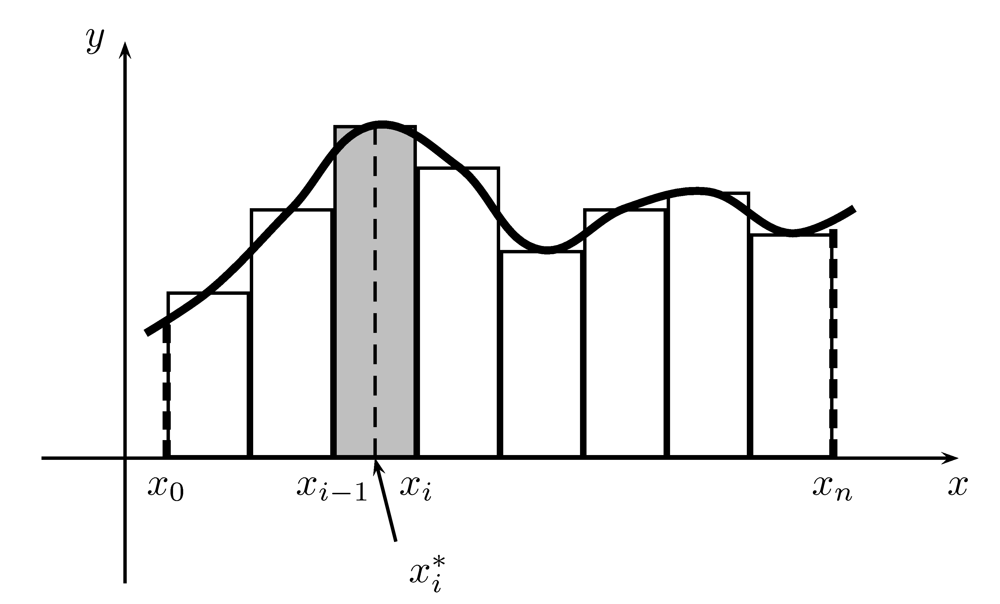
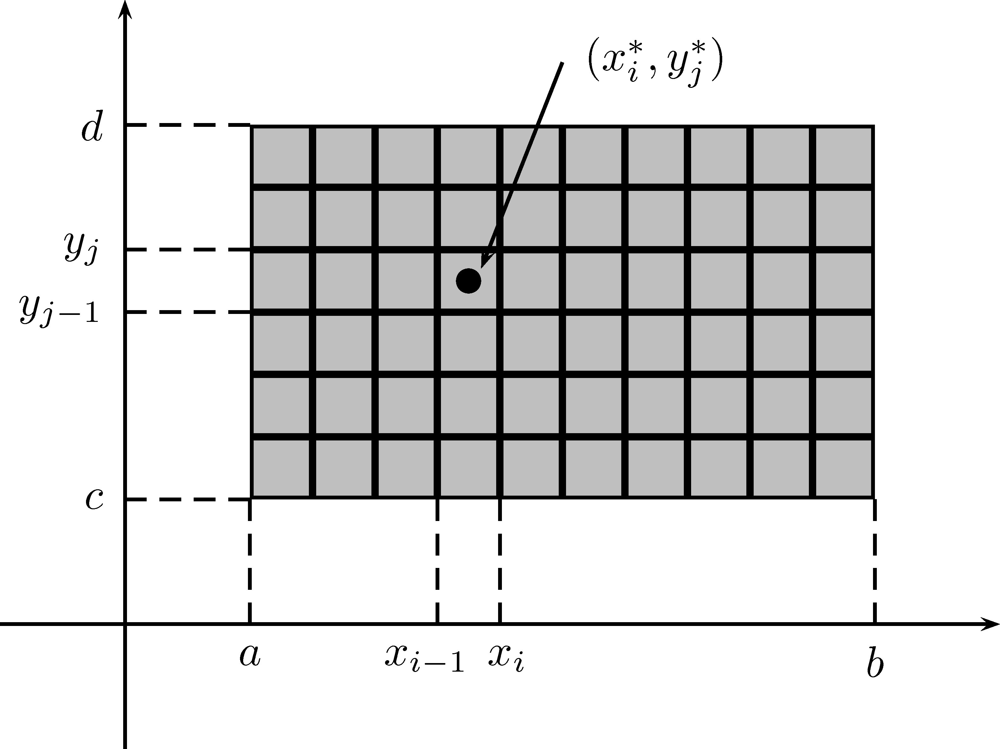
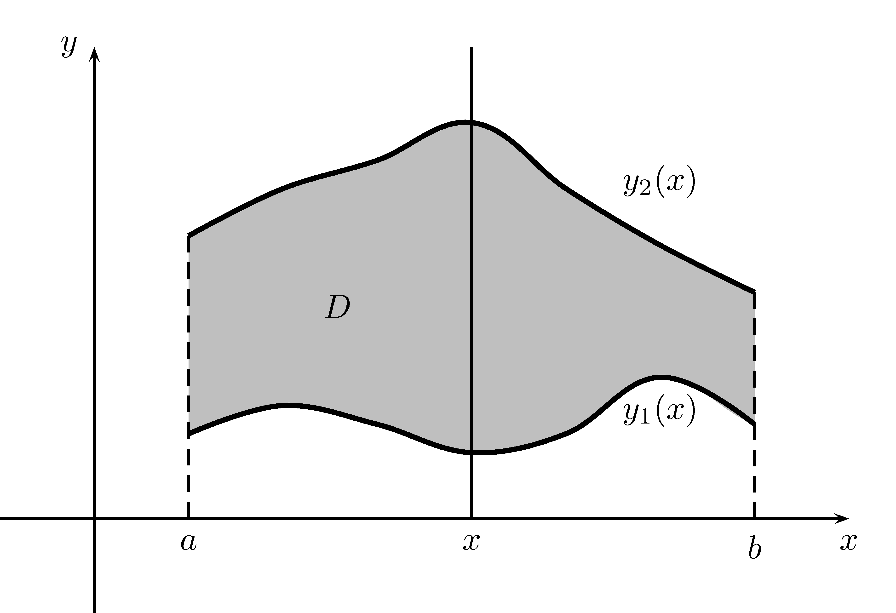

# (PART) L'intégration de fonctions de plusieurs variables {-}

# L'intégration de fonctions de deux variables {#intfct2vars}

Vous trouverez à la section  une application [GeoGebra](https://www.geogebra.org/?lang=fr) vous permettant de visualiser des coupes transversales et des courbes de niveaux. À noter que cette application n'est disponible que dans la version en ligne de ce document.

## Introduction

Dans ce chapitre, nous verrons les intégrales multiples qui sont la généralisation des intégrales pour les fonctions de plusieurs variables. Nous étudierons également les changements de coordonnées afin de simplifier la résolution de ces intégrales.

## Les intégrales doubles

### L'intégrale simple (rappel)

Nous allons débuter en revenant sur la définition de l'intégrale d'une fonction $f(x)$ sur l'intervalle $[a,b]$.

Soit une partition de l'intervalle $[a,b]$: $$P=\{x_0=a,x_1,\ldots,x_{n-1},x_n=b\}$$
Nous notons $\Delta x_i=x_i-x_{i-1}$ la largeur d'un sous-intervalle et $x_i^{*}$ une valeur dans l'intervalle $[x_{i-1},x_i]$. Nous pouvons obtenir une approximation de l'aire algébrique sous la courbe, notée $A_n$: $$A_n=\sum_{i=1}^n f(x_i^*)\Delta x_i$$
La figure \@ref(fig:integralesimple) représente cette somme.
```{r,echo=FALSE,fig.align="center",label="integralesimple",out.width="75%",fig.cap="Graphique représentant $A_n$"}

```
Si nous prenons la limite de $A_n$, lorsque $n$ tend vers l'infini, nous obtenons une somme de Riemann.
```{definition,name="L'intégrale simple"}
L'intégrale simple d'une fonction $f(x)$ sur l'intervalle $[a,b]$ est donnée par:
$$ \int_a^b f(x)dx = \lim_{n\to\infty}\sum_{i=1}^n f(x_i^*)\Delta x_i$$
```
```{remark}
Nous disons que l'intégrale définie correspond à l'aire algébrique sous la courbe, ce qui ne représente pas toujours l'aire géométrique. En effet,si la fonction est négative, alors l'intégrale sera négative. D'où la différence entre l'aire algébrique et géométrique.
```

### L'intégrale double sur un rectangle

D'une manière similaire, nous cherchons à déterminer le volume algébrique d'une fonction $z=f(x,y)$ définie sur un rectangle $$R=\{(x,y)\in\mathbb{R^2}\mid x\in [a,b]\ \text{et}\ y\in[c,d]\}=[a,b]\times[c,d]$$
Pour ce faire, nous divisons $R$ en petits rectangles, comme le montre la figure \@ref(fig:partitionR2). C'est ce que nous appelons une partition de $R$.
```{r,echo=FALSE,fig.align="center",label="partitionR2",out.width="75%",fig.cap="Partition de $R$."}

```
Nous notons par $\Delta x_i=x_i-x_{i-1}$ et $\Delta y_j=y_j-y_{j-1}$. Nous notons également $$R_{ij}=[x_{i-1},x_i]\times[y_{j-1},y_j]$$
Ainsi un élément de volume au-dessus du rectangle $R_{ij}$ est donné par $$V_{ij}=f(x_i^*,y_j^*)\Delta x_i\Delta y_j$$
où $(x_i^*,y_j^*)\in R_{ij}$. Cette expression pour $V_{ij}$ provient du fait que le volume d'un prisme rectangulaire est donné par l'aire de la base $\Delta x_i\Delta y_j$, multipliée par la hauteur $f(x_i^*,y_j^*)$. Nous notons parfois $\Delta x_i\Delta y_j$ par $\Delta A_{ij}$, un petit élément d'aire. En additionnant tous ces petits éléments de volume, nous obtenons une approximation du volume total $$V\approx \sum_{i=1}^{n}\sum_{j=1}^m f(x_i^*,y_j^*)\Delta x_i\Delta y_j$$ La figure \@ref(fig:volumeR2) représente une approximation du volume d'une fonction.
```{r,echo=FALSE,fig.align="center",label="volumeR2",out.width="90%",fig.cap="Visualisation de l'approximation de $V$."}
knitr::include_graphics("resources/images/latex/volumeR2.png")
```
Lorsque $m$ et $n$ deviennent très grands, nous obtenons une meilleure approximation du volume $$V=\lim_{m,n\to\infty}\sum_{i=1}^{n}\sum_{j=1}^m f(x_i^*,y_j^*)\Delta A_{ij}$$
Nous remarquons que l'expression précédente est une double somme de Riemann.
```{definition,label="int-double"}
L'intégrale double de la fonction $f(x,y)$ sur le rectangle $R$ est donnée par: $$\iint\limits_R f(x,y)dA = \lim_{m,n\to\infty}\sum_{i=1}^{n}\sum_{j=1}^m f(x_i^*,y_j^*)\Delta A_{ij}$$
```
```{remark}
Si la fonction $f(x,y)\geq 0$ sur $R$, alors l'intégrale double correspond au volume géométrique entre la fonction $f$ et le plan $z=0$.
```
La définition \@ref(def:int-double) est difficilement utilisable, nous aurons donc besoin de faire nos intégrales différemment.

### Les intégrales itérées {#integrales-iterees}

Nous voulons maintenant transformer des intégrales doubles en deux intégrales simples. Nous savons qu'un élément de volume correspond à un élément d'aire multiplié par une hauteur. Cependant, rien ne nous oblige à utiliser $\Delta x_i\Delta y_j$ comme élément d'aire. Nous allons plutôt fixer la variable $x$ et calculer l'aire de cette section de volume. Cette aire dépend de la valeur de $x$. Notons-la $A(x)$. Puisque $x$ est fixe (une constante), nous avons que l'aire de la section est donnée par: $$A(x)=\int_c^{d} f(x,y)dy$$ Pour déterminer le volume, il suffit d'additionner toutes les aires de section que l'on multiplie par un petit élément de hauteur $dx$. Ceci correspond à $$V=\int_a^b A(x)dx=\int_a^b\left(\int_c^{d} f(x,y)dy\right)dx$$
Nous avons donc que:$$\iint\limits_D f(x,y) dA=\int_a^b\left(\int_c^{d} f(x,y)dy\right)dx$$
D'une manière similaire, nous pouvons trouver que: $$\iint\limits_D f(x,y) dA=\int_c^d\left(\int_a^{b} f(x,y)dx\right)dy$$
```{definition,name="Intégrales doubles itérées",label="integrale-double-iteree"}
Nous avons: $$\iint\limits_D f(x,y) dA=\int_a^b\left(\int_c^{d} f(x,y)dy\right)dx$$
  et
$$\iint\limits_D f(x,y) dA=\int_c^d\left(\int_a^{b} f(x,y)dx\right)dy$$
```

```{example}
Trouvez l'intégrale de $f(x,y)=x^2y$ sur le rectangle $R=[0,3]\times[1,2]$, en utilisant les deux intégrales de \@ref(def:integrale-double-iteree).
```
\vspace*{8cm}

```{example}
Trouvez l'intégrale de $f(x,y)=\frac{x-y}{(x+y)^3}$ sur le rectangle $R=[0,1]\times[0,1]$, en utilisant les deux intégrales de \@ref(def:integrale-double-iteree).
```
\vspace*{8cm}

```{theorem,name="Fubini",label="fubini"}
Si $f$ est continue sur un rectangle $R=[a,b]\times[c,d]$, alors:
\begin{align*}
\int_a^b\int_c^df(x,y)\ dy\ dx=\int_c^d\int_a^bf(x,y)\ dx\ dy
\end{align*}
```
Au théorème \@ref(thm:fubini), nous avons enlevé les crochets dans l'intégrale. Par définition:
\begin{align*}
\int_a^b\int_c^df(x,y)\ dy\ dx
\end{align*}
signifie que nous intégrons tout d'abord par rapport à $y$ et par la suite par rapport à $x$.

Le théorème de Fubini signifie que si la fonction est continue (ce qui sera le cas pour les fonctions du cours), alors on peut changer l'ordre d'intégration sans changer le résultat. 
```{example}
Trouvez le volume délimité par $z=x\sqrt{x^2+y}$, $x=0$, $x=1$, $y=0$, $y=1$ et $z=0$.
```
\vspace*{8cm}

```{example}
Trouvez l'intégrale de $f(x,y)=xy$ sur le rectangle $R=[1,2]\times[0,4]$.
```
\vspace*{8cm}

### Les intégrales doubles sur une région quelconque

Comme vu à la section \@ref(derivfctvars), nous savons comment intégrer sur un rectangle. Malheureusement, le domaine d'intégration n'est pas toujours un rectangle. La situation se présente régulièrement où le domaine est délimité par des courbes dans le plan. Supposons que le domaine d'intégration $D$ est défini comme suit: $$D=\{(x,y)\in\mathbb{R}^2\mid a\leq x\leq b,\ y_1(x)\leq y \leq y_2(x)\}$$
Dans cette situation, lorsque nous fixons la variable $x$ pour déterminer l'aire d'une section, les bornes d'intégration dépendent de la valeur $x$. Ainsi: $$A(x)=\int_{y_1(x)}^{y_2(x)}f(x,y)dy$$
D'où $$\iint\limits_D f(x,y)dA=\int_a^b \int_{y_1(x)}^{y_2(x)}f(x,y)dy dx$$
Nous présentons à la figure \@ref(fig:itereeX) une représentation de ce domaine.
```{r,echo=FALSE,fig.align="center",label="itereeX",out.width="75%",fig.cap="Domaine d'intégration $D$ lorsque les courbes sont des fonctions de $x$."}

```

D'une manière similaire, si $D$ est défini par $$D=\{(x,y)\in\mathbb{R}^2\mid x_1(y)\leq x\leq x_2(y),\ c\leq y \leq d\}$$
alors $$\iint\limits_D f(x,y)dA=\int_c^d \int_{x_1(y)}^{x_2(y)}f(x,y)dx dy$$
Nous présentons à la figure \@ref(fig:itereeY) une représentation de ce domaine.
```{r,echo=FALSE,fig.align="center",label="itereeY",out.width="75%",fig.cap="Domaine d'intégration $D$ lorsque les courbes sont des fonctions de $y$."}
knitr::include_graphics("resources/images/latex/itereeY.png")
```

```{example}
Calculez le volume du solide compris entre $z=0$ et $z=5+2xy$ au-dessus de la région délimitée par $y=x$ et $y=\sqrt{x}$.
```
\vspace*{8cm}

```{example}
Trouvez $\iint\limits_D (2y-x^2)dA$ sur la région $0\leq x\leq 2$ et $x^2\leq y \leq 9-x$.
```
\vspace*{8cm}

```{example}
Trouvez $\iint\limits_D (x^2+y^2)dA$ sur la région triangulaire délimitée par les points $(0,0)$, $(2,0)$ et $(1,1)$.
```
\vspace*{8cm}

```{example}
Trouvez $\iint\limits_D (1+x+y)dA$ sur la région délimitée par $y=-x$, $y=2$ et $x=y^2$.
```
\vspace*{8cm}

```{example}
Calculez le volume délimité par les plans $x+y+z=1$, $x=0$, $y=0$ et $z=0$.
```
\vspace*{8cm}

### Changer l'ordre d'intégration

Il arrive parfois qu'une intégrale double ne se calcule pas lorsque nous tentons d'utiliser l'ordre d'intégration proposé. Pour tenter de calculer l'intégrale, nous allons changer l'ordre d'intégration.

Pour ce faire, voici les étapes:

1. Dessiner le domaine d'intégration.

1. Changer l'ordre d'intégration en se basant sur le dessin.

1. Calculer l'intégrale résultante.

```{example}
Calculez $\int_0^1\int_x^1 \sin(y^2)dydx$.
```
\vspace*{8cm}

```{example}
Calculez $\int_0^1\int_{e^y}^e \frac{x}{\ln(x)}dxdy$.
```
\vspace*{8cm}

```{example}
Calculez $\int_0^e\int_{0}^{\ln(x)} ydydx$.
```
\vspace*{8cm}

```{example}
Calculez $\int_0^3\int_{y^2}^{9} y\cos(x^2)dxdy$.
```
\vspace*{8cm}

### Les propriétés de l'intégrale double

Voici quelques propriétés de l'intégrale double.
```{theorem}
Soit $f(x,y)$ et $g(x,y)$ deux fonctions définies sur un domaine $D$. Nous avons alors:
  
1. $\iint\limits_D \left[f(x,y)\pm g(x,y)\right]dA=\iint\limits_D f(x,y)dA \pm \iint\limits_D g(x,y)dA$
  
1. $\iint\limits_D kf(x,y)dA=k\iint\limits_D f(x,y)dA$ où $k$ est une constante

1. Si $f(x,y)\geq g(x,y)$, $\forall$ $(x,y)\in D$, alors $\iint\limits_D f(x,y)dA\geq \iint\limits_D g(x,y)dA$
  
1. Si $D=D_1 \cup D_2$, alors $\iint\limits_D f(x,y)dA=\iint\limits_{D_1} f(x,y)dA+\iint\limits_{D_2} f(x,y)dA$
  
1. $\iint\limits_D 1dA=$ aire de $D$

```
```{proof}
Les propriétés sont énoncées sans démonstration.
```

Ces propriétés sont très utiles, particulièrement la 4. Elle permet de scinder en plusieurs parties un domaine d'intégration.

```{example}
Soit une fonction $f(x,y)\geq 0$. Écrivez l'expression permettant de calculer lee volume sous $f(x,y)$ au dessus du triangle dont les sommets sont $(1,1)$, $(2,2)$ et $(-1,3)$.
```
\vspace*{8cm}

```{example}
Trouvez $\iint\limits_D (2y+x)dA$ sur la région formée de l'union des régions 1 et 2. La région 1 est telle que $0\leq x \leq 2$ et $0\leq y \leq x^2+1$. La région 2 ests telle que $2\leq x\leq 7$ et $0\leq y \leq 7-x$.
```
\vspace*{8cm}

## Les intégrales doubles en coordonnéees polaires

Dans certains cas, il est difficile de calculer certaines intégrales en coordonnées cartésiennes et ce, pour différentes raisons. Parfois le domaine d'intégration est difficile à écrire en coordonnées cartésiennes. Par exemple, si le domaine d'intégration est celui présenté à la figure \@ref(fig:demianneau), il serait alors plus simple d'utiliser les coordonnées polaires.
```{r,echo=FALSE,fig.align="center",label="demianneau",out.width="75%",fig.cap="Une région sur laquelle nous voulons intégrer qui se prête particulièrement bien aux coordonnées polaires."}
knitr::include_graphics("resources/images/latex/demianneau.png")
```
Voyons comment nous pouvons effectuer le changement de coordonnées. Supposons tout d'abord que le domaine est un rectangle polaire, c'est-à-dire que:
$$D=\{(r,\theta)|a\leq r\leq b,\alpha \leq \theta\leq \beta\}$$
Divisons maintenant ce rectangle polaire en petits rectangles polaires. Posons
\begin{align*}
R_{i,j}&=\{(r,\theta)|r_{i-1}\leq r\leq r_{i},\theta_{j-1} \leq \theta\leq \theta_j \},\\
\Delta \theta_j&=\theta_j-\theta_{j-1},\\
\Delta r_i&=r_i-r_{i-1}.
\end{align*}
La figure \@ref(fig:partition-rectangle-polaire) représente un rectangle polaire ainsi qu'une partition possible de ce rectangle.
```{r,echo=FALSE,fig.show='hold',fig.align="center",label="partition-rectangle-polaire",out.width="45%",fig.cap="Un rectangle polaire et une partition du rectangle polaire."}
knitr::include_graphics(c("resources/images/latex/rectanglepolaire.png","resources/images/latex/partitionrectpolaire.png"))
```
Le volume délimité par le rectangle polaire $R_{ij}$ et la fonction $f(x,y)$ est donné par:
\begin{align*}
V_{ij}&\approx f(x_i^*,y_j^*)\Delta A_{i,j}\\
&\approx f(r_i^*\cos \theta_j^*,r_i^*\sin \theta_j^*)\Delta A_{i,j},
\end{align*}
où $(r_i^*,\theta_j^*)$ est le point au centre de $R_{i,j}$. Il ne reste plus qu'à déterminer $\Delta A_{i,j}$ qui correspond à l'aire de $R_{i,j}$. Nous savons que l'aire d'une section de disque de rayon $R$ est donnée par:
\begin{align*}
A=\dfrac{1}{2}R^2\varphi
\end{align*}
où $\varphi $ est l'angle au centre. Ainsi, nous pouvons trouver $\Delta A_{i,j}$ en effectuant la différence de l'aire deux sections. D'où:
\begin{align*}
\Delta A_{i,j}= \frac{1}{2}r_i^2\Delta \theta_j-\frac{1}{2}r_{i-1}^2\Delta \theta_j.
\end{align*}
Nous allons manipuler l'expression précédente pour la simplifier.
\begin{align*}
\Delta A_{i,j}&= \frac{1}{2}r_i^2\Delta \theta_j-\frac{1}{2}r_{i-1}^2\Delta \theta_j\\
&= \frac{1}{2}\left(r_i^2- r_{i-1}^2  \right)\theta_j\\
&= \underbrace{\frac{1}{2}(r_i+r_{i-1})}_{=r_i^*}\underbrace{(r_i-r_{i-1})}_{=\Delta r_i} \Delta \theta_j \\
&=r_i^*\Delta r_i\Delta \theta_j. 
\end{align*}
Ainsi, 
\begin{align*}
V_{i,j}\approx f(r_i^*\cos \theta_j^*,r_i^*\sin \theta_j^*)r_i^*\Delta r_i\Delta \theta_j
\end{align*}
Posons $g(r,\theta)=rf(r\cos\theta, r\sin\theta)$. Maintenant, trouvons une expression pour l'intégrale double. 
\begin{align*}
\iint\limits_Df(x,y)dA&:=\lim_{m,n\to\infty }\sum_{i=1}^n\sum_{j=1}^mf(r_i^*\cos \theta_j^*,r_i^*\sin \theta_j^*)\Delta A_{i,j}\\
&=\lim_{m,n\to\infty }\sum_{i=1}^n\sum_{j=1}^mg(r_i^*,\theta_j^*)\Delta r_i\Delta \theta_j\\
&=\int_{\alpha }^{\beta }\int_{a }^{b }g(r,\theta)drd\theta\\
&=\int_{\alpha }^{\beta }\int_{a }^{b }f(r\cos\theta,r\sin\theta)rdrd\theta
\end{align*}

```{remark}
Il est important de voir que $dxdy=rdrd\theta$. Ainsi, nous devons multiplier la fonction par $r$ lorsque nous passons en coordonnées polaires.
```

```{example}
Trouvez $\iint\limits_D (x^2+y^2)dA$ sur le disque de rayon 1 centré à l'origine.
```
\vspace*{8cm}

```{example}
Trouvez $\iint\limits_D \frac{1}{e^{x^2+y^2}}dA$ sur le quart de disque de rayon 3 centré à l'origine.
```
\vspace*{8cm}

Nous avons montré le changement en coordonnées polaires lorsque le domaine est un rectangle polaire. Cependant, tout comme pour les coordonnées cartésiennes, il est possible de fixer une variable et de faire varier l'autre, ce qui entraîne que les bornes peuvent dépendre d'une variable. La figure \@ref(fig:r-depend-theta) présente les deux possibilités, que la variable $r$ dépende de $\theta$ ou que la variable $\theta$ dépende de $r$.
```{r,echo=FALSE,fig.show='hold',fig.align="center",label="r-depend-theta",out.width="45%",fig.cap="La variable $r$ peut dépendre de $\\theta$ et vice-versa."}
knitr::include_graphics(c("resources/images/latex/rdependtheta.png","resources/images/latex/thetadependr.png"))
```
Dans le cas de la figure \@ref(fig:r-depend-theta) de gauche, l'intégrale devient:
\begin{align*}
\iint\limits_D f(x,y)dA=\int_{\alpha }^{\beta}\int_{r_1(\theta)}^{r_2(\theta)}f(r\cos\theta,r\sin\theta)rdrd\theta
\end{align*}
Dans le cas de la figure \@ref(fig:r-depend-theta) de droite, l'intégrale devient: 
\begin{align*}
\iint\limits_Df(x,y)dA=\int_{a}^{b}\int_{\theta_1(r)}^{\theta_2(r)}f(r\cos\theta,r\sin\theta)rd\theta dr
\end{align*}

```{remark}
Nous allons nous intéresser à un cas particulier. Soit $f(x,y)=1$, alors l'inttégrale double calcule maintenant la surface du domaine d'intégration. Si nous nous plaçons dans le premier cas où la variable $r$ dépend de $\theta$, c'est-à-dire $r_1(\theta)=0$ et $r_2(\theta)=r(\theta)$ pour $\alpha \leq \theta \leq \beta$, nous obtenons:
\begin{align*}
\text{Aire}(D)&=\int_{\alpha }^{\beta }\int_0^{r(\theta)}rdrd\theta\\
&=\int_{\alpha }^{\beta }\left.\dfrac{r^2}{2}\right|_0^{r(\theta)}d\theta\\
&=\int_{\alpha }^{\beta }\dfrac{r^2(\theta)}{2}\theta
\end{align*}
L'équation précédente correspond au résultat obtenu au chapitre \@ref(coordpolaires) pour le calcul de l'aire d'une région polaire.
```

```{example}
Trouvez $\int_0^1 \int_y^{\sqrt{2-y^2}} (x^2+y^2) dx dy$.
```
\vspace*{8cm}

```{example}
Trouvez $\iint\limits_D \frac{1}{\sqrt{x^2+y^2}}dA$ sur la région bornée par $y=\sqrt{3}x$, $x=3$ et $y=0$.
```
\vspace*{8cm}

```{example}
Déterminez l'aire de la région située entre $r=3+2\sin(\theta)$ et $r=2$.
```
\vspace*{8cm}

## Le changement de coordonnées pour les intégrales doubles

Il existe d'autres systèmes de coordonnées autres que les systèmes cartésiens et polaires. En réalité, il est souvent impossible de résoudre certaines intégrales en n'utilisant que ces deux systèmes. Par exemple, si nous voulons calculer $\iint\limits_D 1 dA$ sur le domaine 
$D=\left\{(x,y)\in\mathbb{R}^2\left| \frac{x^2}{a^2}+\frac{y^2}{b^2}\leq 1 \right. \right\}$, il devient très difficile de faire cette intégrale en n'utilisant que les deux systèmes que nous connaissons. Heureusement, il existe une technique permettant de trouver le terme $dA$ lorsque nous effectuons un changement de variables. Avant de débuter, nous ferons un bref rappel du produit vectoriel.

### Le produit vectoriel

Soit deux vecteurs de $\mathbb{R}^3$ non-colinéaires tels que $\overrightarrow{u}=[u_1,u_2,0]$ et $\overrightarrow{v}=[v_1,v_2,0]$. L'aire du parallélogramme engendré par ces vecteurs est donnée par:
\begin{align*}
A&= \| \vec u \times \vec v\| \\
&= \left\| \ \left| \begin{array}{ccc}
\vec i &\vec j& \vec k\\
u_1 & u_2 &0 \\
v_1 & v_2 &0
\end{array}
\right|\ \right\| \\
 &=\left\|   0\vec i - 0\vec j+\left|
\begin{array}{cc}
u_1 & u_2  \\
v_1 & v_2 
\end{array}  
\right|\vec k \ \right\| \\
&= \left| det  \left(\begin{array}{cc}
u_1 & u_2  \\
v_1 & v_2 
\end{array}  \right) \right|
\end{align*}
L'aire du prallélogramme est donc donnée par la valeur absolue du déterminant des deux vecteurs.

### Le changement de coordonnées

Nous voulons déterminer une expression dans un autre système de coordonnées (par exemple $u$ et $v$) pour $\iint\limits_D f(x,y)dA$. Plus précisément, nous voulons trouver une expression pour $dA$ en fonction de $u$ et $v$. Pour ce faire, supposons qu'il existe une transformation bijective et dérivable $T$ qui prend une région $D'$ du plan $uv$ et qui l'envoie sur $D$ dans le plan $xy$. Ceci signifie que $T$ prend un point $(u,v)\in D'$ et l'envoie sur le point $(x(u,v),y(u,v))\in D$. La figure \@ref(fig:jacobien2d) représente cette transformation.
```{r,echo=FALSE,fig.align="center",label="jacobien2d",out.width="75%",fig.cap="La représentation de l'effet de la transformation $T$ sur un rectangle dans le plan $x$ et $y$."}
knitr::include_graphics("resources/images/latex/jacobien2d.png")
```
Nous allons étudier le résultat de cette transformation sur un petit rectangle de dimension $\Delta u \times \Delta v$ dans le plan $uv$. Notons par $P=T(P')$, $Q=T(Q')$ et $R=T(R')$. On sait qu'une petite variation $\Delta x$ peut être obtenue par
\begin{align*}
\Delta x\approx \frac{\partial x}{\partial u}\Delta u+\frac{\partial x}{\partial v}\Delta v
\end{align*}
De même, on a 
\begin{align*}
\Delta y\approx \frac{\partial y}{\partial u}\Delta u+\frac{\partial y}{\partial v}\Delta v 
\end{align*}
Ainsi, le vecteur $\overrightarrow{PQ}=\left[\frac{\partial x}{\partial u}\Delta u,\frac{\partial y}{\partial u}\Delta u\right]$, car $\Delta v=0$ puisque les points $P'$ et $Q'$ont la même composante $v$. De même, on a que le vecteur \\$\overrightarrow{PR}=\left[\frac{\partial x}{\partial v}\Delta v,\frac{\partial y}{\partial v}\Delta v\right]$ pour des raisons similaires. Maintenant, l'élément d'aire $\Delta A$ formé par $\Delta u$ et $\Delta v$ s'exprime en terme d'aire de parallélogramme 
\begin{align*}
\Delta A&\approx \left\| \overrightarrow{PQ}\times    \overrightarrow{PR}\right\| \\
&\approx \left\| \left| 
\begin{array}{ccc}
\vec i &\vec j& \vec k\\
\frac{\partial x}{\partial u}\Delta u & \frac{\partial y}{\partial u}\Delta u &0 \\
\frac{\partial x}{\partial v}\Delta v & \frac{\partial y}{\partial v}\Delta v &0
\end{array}  \right|   \right\|\\
&\approx 
\left\| 0\vec i -0\vec j+ \left| 
\begin{array}{cc}
\frac{\partial x}{\partial u}\Delta u & \frac{\partial y}{\partial u}\Delta u \\
\frac{\partial x}{\partial v}\Delta v & \frac{\partial y}{\partial v}\Delta v 
\end{array}  \right| \vec k  \right\|\\
&\approx 
\sqrt{\left(\frac{\partial x}{\partial u}\Delta u \frac{\partial y}{\partial v}\Delta v- \frac{\partial y}{\partial u}\Delta u \frac{\partial x}{\partial v}\Delta v\right)^2}\\
&\approx 
\left|\frac{\partial x}{\partial u}\frac{\partial y}{\partial v}- \frac{\partial y}{\partial u} \frac{\partial x}{\partial v}\right|\Delta u\Delta v.\\
\end{align*}
À la limite où $\Delta u$ et $\Delta v$ tendent vers $0$, nous obtenons une expression pour $dA$:
\begin{align*}
dA=\left|\frac{\partial x}{\partial u}\frac{\partial y}{\partial v}- \frac{\partial y}{\partial u} \frac{\partial x}{\partial v}\right|dudv
\end{align*}

```{definition,name="Jacobien"}
Soit une transformation dérivable $T:(u,v)\rightarrow (x(u,v),y(u,v))$. Nous appelons Jacobien le déterminant suivant:
\begin{align*}
J&=\left|\begin{array}{cc}
\frac{\partial x}{\partial u} & \frac{\partial x}{\partial v} \\
\frac{\partial y}{\partial u} & \frac{\partial y}{\partial v}
\end{array}   \right|
=\frac{\partial x}{\partial u}\frac{\partial y}{\partial v}- \frac{\partial y}{\partial u} \frac{\partial x}{\partial v}
\end{align*}

```

```{remark}
Nous notons le Jacobien d'une transformation par $J$, $J_{u,v}$ ou $\frac{\partial (x,y)}{\partial (u,v)}$.
```

Nous pouvons donc écrire $dA=|J|dudv$, d'où:
$$\iint\limits_D f(x,y)dA=\iint\limits_{D'} f(x(u,v),y(u,v))|J|dudv$$

```{example}
Démontrez qu'un élément d'aire en coordonnées polaires est $rdrd\theta$.
```
\vspace*{5cm}

```{example}
Calculez $\iint\limits_D e^{\tfrac{x+y}{x-y}}dA$ où $D$ est la région délimitée par le trapèze de sommets $(1,0)$, $(2,0)$, $(0,-2)$ et $(0,-1)$.
```
\vspace*{10cm}

```{example}
Calculez $\iint\limits_D (x^2-xy+y^2)dA$ où $D$ est l'ellipse donnée par $x^2-xy+y^2=2$ en utilisant la transformation:
\begin{align*}
x &= \sqrt{2}u-\sqrt{2/3}v \\
y &= \sqrt{2}u+\sqrt{2/3}v 
\end{align*}

```
\vspace*{8cm}

```{example}
Calculez $\iint\limits_D e^{x+y}dA$ où $D$ est $|x|+|y|\leq a$.
```
\vspace*{8cm}


